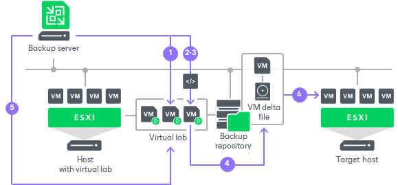

# Staged Restore

Staged restore allows you to run an executable script for VMs before recovering them to the production environment. Staged restore is a part of the entire VM restore operations. To perform staged restore, you must select the Staged Restore mode in the [Full VM Restore](performing_full_recovery.md) wizard and specify [staged restore settings](full_restore_staged_vm.md).

Staged restore can help you ensure that recovered VMs do not contain any personal or sensitive data. For example, you can instruct Veeam Backup & Replication to run a [Windows PowerShell script](https://docs.microsoft.com/en-us/powershell/module/activedirectory/remove-aduser?view=windowsserver2022-ps) that removes Active Directory users:

|  |
| --- |
| $UserName = "John.Smith"  $ADUser = Get-ADUser -Filter 'Name -like $UserName'  if (!$ADUser)     {         [Environment]::Exit(1)     }  Remove-ADUser -Identity $UserName -Confirm:$false |

|  |
| --- |
| Note |
| The availability of the staged restore feature depends on the license you use. For more details about licensing support, see [Veeam Data Platform Feature Comparison](https://www.veeam.com/veeam_data_platform_feature_comparison_ds.pdf). |

Requirements and Limitations for Staged Restore

Before you perform staged restore, check the following prerequisites:

* You must have a preconfigured virtual lab in your backup infrastructure. For more information, see [Virtual Lab](virtual_lab.md).
* Scripts that you plan to run must reside in a local folder on a backup server.

* If you plan to perform staged restore for several VMs within one restore session, make sure these VMs run OS of the same type: either Microsoft Windows or Linux. In the current version of Veeam Backup & Replication, you cannot specify credentials and scripts for each VM individually.
* When restoring VMs, Veeam Backup & Replication uses the Veeam Quick Migration method. vMotion and Storage vMotion methods cannot be used. For more information on the Quick Migration method, see [Quick Migration](quick_migration.md).

* [For Linux-based backup server] To upload scripts to the Linux backup server, in the Veeam Backup & Replication console, navigate to the Files node. Then, copy script files to the /var/lib/veeam/scripts folder on the Linux backup server.

How Staged Restore Works

For staged restore, Veeam Backup & Replication uses a preconfigured virtual lab, an executable script located on the backup server, and credentials to connect to VMs and run the script. Veeam Backup & Replication performs staged restore in the following way:

1. In the virtual lab, Veeam Backup & Replication starts VMs directly from compressed and deduplicated backup files that reside in the backup repository. To achieve this, Veeam Backup & Replication uses the [Veeam vPower NFS Service](vpower_nfs_service.md).

If you selected to use an application group to run a script, Veeam Backup & Replication first starts VMs from the application group in the required order.

1. Veeam Backup & Replication copies the script from the backup server to VMs that you plan to restore.

To connect to VMs, Veeam Backup & Replication uses credentials specified in staged restore settings.

1. Veeam Backup & Replication runs the copied script on every VM.

To run the script, Veeam Backup & Replication uses the same technology as for pre-freeze and post-thaw scripts. For more information, see [Pre-Freeze and Post-Thaw Scripts](pre_post_scripts.md).

1. All VM changes that take place during script execution are written to VM delta files.

By default, Veeam Backup & Replication stores delta files on the [vPower NFS server](vpower_nfs_service.md). You can change the destination for VM delta files in virtual lab settings.

1. After the script execution is complete, Veeam Backup & Replication makes a safe shutdown of VMs in the virtual lab.
2. Veeam Backup & Replication restores VMs in a changed state to the production environment.

To achieve that, Veeam Backup & Replication copies VM data from the backup repository and delta files to the target host using Veeam Quick Migration.

Related Topics

* [Virtual Lab](virtual_lab.md)
* [Application Group](application_group.md)

* [Veeam vPower NFS Service](vpower_nfs_service.md)

* [Quick Migration](quick_migration.md)

* [Pre-Freeze and Post-Thaw Scripts](pre_post_scripts.md)

