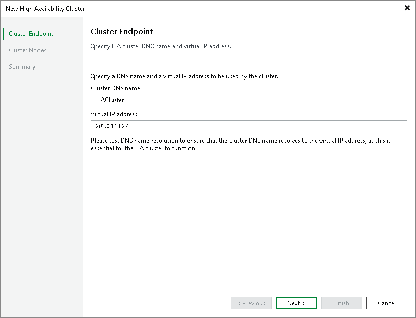

# Step 3a. Specify Standard Cluster Endpoint Settings

At the Cluster Endpoint step of the wizard, specify the name and a virtual IP address of the cluster.

1. In the Cluster DNS name field, specify a DNS name of the cluster.

|  |
| --- |
| Note |
| If you plan to use the DNS name to access your cluster, you must configure this DNS name to resolve to the сluster IP address. |

1. In the Virtual IP address field, specify the static IP address of the cluster. Veeam Backup & Replication will assign this IP address to the primary node.

|  |
| --- |
| Note |
| If Veeam Backup & Replication detects that the backup server is already managed by Enterprise Manager, it displays a prompt asking whether to open the Enterprise Manager web UI so you can re-add the backup server using the cluster IP address after you assemble the cluster. |

Page updated 2026-07-08

