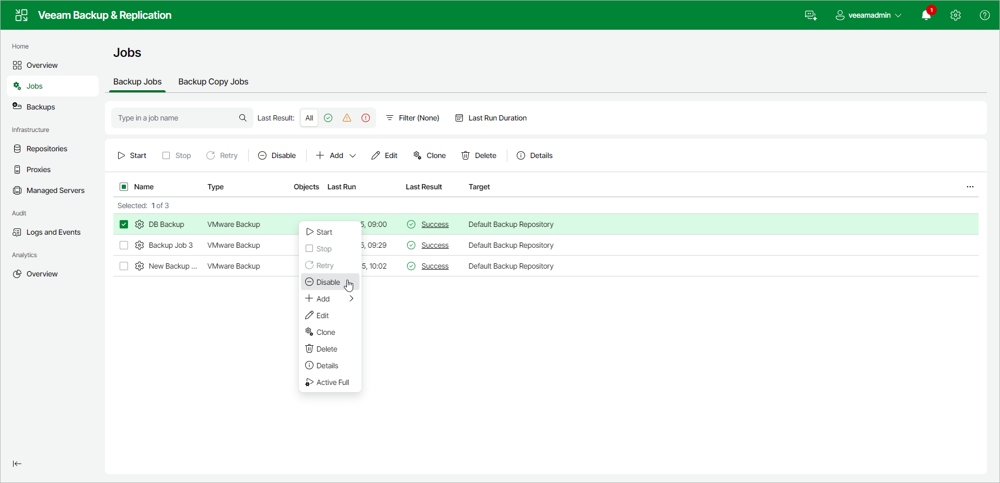

# Starting and Stopping Transaction Log Backup Jobs

If you create a backup job and instruct it to ship transaction logs, the backup job comprises 2 jobs:

1. A parent backup job creates an image-level backup of the VM on which the database runs. This job is named like a regular backup job, for example, Daily Job.
2. A transaction log backup job is responsible for shipping transaction logs to the backup repository. This job is named according to the following pattern:

* For MS SQL: <job\_name> SQL Server Transaction Log Backup. For example, Daily Job SQL Server Transaction Log Backup.
* For Oracle: <job\_name> Oracle Redo Log Backup. For example, Daily Job Oracle Redo Log Backup.

The transaction log backup job is created automatically by Veeam Backup & Replication if it detects that you have added to the backup job at least one Microsoft SQL Server or Oracle VM, enabled application-aware processing and instructed Veeam Backup & Replication to back up transaction logs periodically.

Starting Transaction Log Backup Jobs

A parent backup job is manually started when you click Start on the toolbar or automatically by schedule. The transaction log backup job is initially started when you enable the schedule for the parent backup job. The transaction log backup works continuously in the background. A new session of the transaction log backup job starts every time the parent backup job is launched.

Stopping Transaction Log Backup Jobs

You can stop transaction log processing in one of the following ways:

* [Disable transaction log shipping](#aaip)
* [Disable the parent backup job](#parent)

Disabling Transaction Log Shipping

If you want the backup job to create image-level backups of the VM, but do not want it to ship transaction logs anymore, you can disable transaction log backup in the backup job settings.

To disable transaction log shipping:

1. In the management pane, click the Jobs node.
2. In the working area, select a backup job and click Edit on the ribbon or right-click a backup job and select Edit.
3. Proceed to the Guest Processing step of the wizard and click Application-aware processing options.
4. In the Application-Aware Processing Options window, select a VM and click Edit.
5. On the SQL or Oracle tab of the Processing Settings window, disable transaction log backup.
6. Click Finish to save the job settings.

Disabling the Parent Backup Job

If you do not want to create image-level backups of the VM and back up database transaction logs, you can disable scheduling for the parent backup job. Veeam Backup & Replication will instruct the transaction log backup job to complete log processing for all VMs added to the parent backup job and will switch the parent backup job to the non-scheduled mode. The parent backup job will no longer be started automatically by schedule — you will have to run it manually.

To disable scheduling for the parent backup job:

1. In the management pane, click the Jobs node.
2. In the working area, select a backup job and click Edit on the ribbon. Alternatively, you can right-click a backup job and select Edit.
3. Proceed to the Schedule step of the wizard and clear the Run the job automatically check box.
4. Click Finish to save the job settings.

Alternatively, you can disable the parent backup job:

1. In the management pane, click the Jobs node.
2. In the working area, select a backup job and click Disable on the ribbon or right-click a job and select Disable.

To re-activate transaction log processing for all VMs in the parent backup job, select the job in the list and click Enable on the ribbon again.

