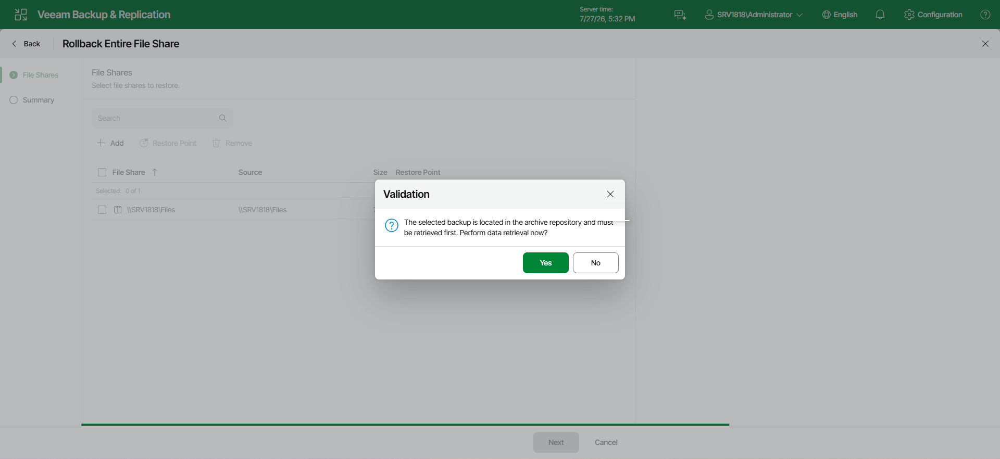

# Step 1. Launch Retrieve Backup Wizard

To launch the retrieval job, do the following:

In the web UI, start restoring the required objects. At the [Select Restore Point](restore_individual_objects_restore_point_web.md) step of the restore wizard, if the selected restore point has not been retrieved yet, you will be prompted to launch the Retrieve Backup wizard.

Page updated 2026-07-28

