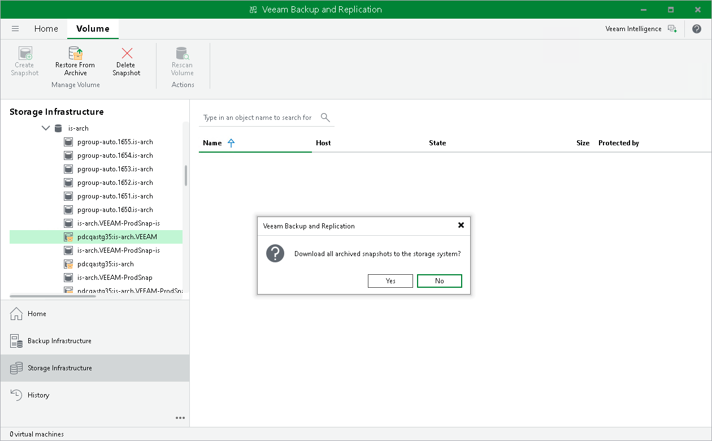

# Retrieving Archived Snapshots

Snapshot archiving allows jobs to manage the offload of long-term snapshots to a 3rd party storage solution supported by a storage vendor (for example, Amazon S3 storage or NFS target). Snapshot archiving is helpful when you need to save rarely accessed data. For information on which storage systems support snapshot archiving, see [Supported Storage Features for Backup and Orchestration](supported_features.md). To archive (offload) snapshots, create a snapshot-only job or a backup from storage snapshot job with the archiving feature enabled. For more information, see [Configuring Backup from Snapshots on Secondary Storage Arrays](storage_secondary_backup_perform.md#archive) or [Configuring Snapshot-Only Jobs](snapshot_only_job_perform.md#archive). Archived snapshots are shown under the  icon.

To access data from archived snapshots, it must be retrieved. During the snapshot retrieval process, a copy of the archived snapshot is created on the storage system from which the snapshot was archived (offloaded). This copy is stored on the storage system until you delete the copy manually as described in section [Deleting Snapshots](storage_create_snapshot.md#delete).

Data retrieval can be required if you want to restore workloads from archived snapshots. Veeam Backup & Replication retrieves data automatically when you launch restore. However, you can still retrieve data manually. Also, manual retrieve is required if a snapshot is created during the [rescan (storage discovery) process](storage_discovery_process.md).

To retrieve an archived snapshot manually:

1. Open the Storage Infrastructure view.
2. In the inventory pane, expand the storage system tree.
3. Right-click the necessary snapshot and select Restore snapshot from archive. Alternatively, you can click Restore from Archive on the ribbon.
4. In the Veeam Backup & Replication window, click Yes.

After the retrieval finishes, Veeam Backup & Replication will show the retrieved snapshots under the  icon.

|  |
| --- |
| Note |
| Consider the following:   * One archived snapshot can have only one retrieved copy. You can retrieve the archived snapshot only after you delete the already retrieved copy as described in section [Deleting Snapshots](storage_create_snapshot.md#delete). * Snapshot retention does not apply to retrieved snapshots. |

