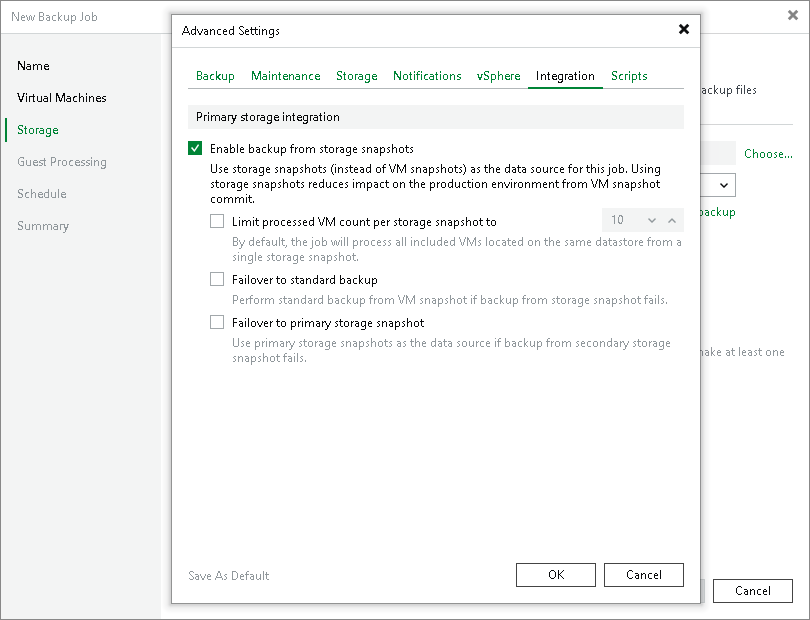
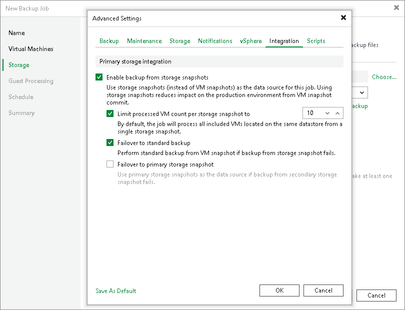

# Configuring Backup from Storage Snapshots

In this article

You can instruct Veeam Backup & Replication to use backup from storage snapshots for backup and replication. During backup and replication jobs, Veeam Backup & Replication reads data of processed VMs from temporary storage snapshots, which speeds up backup and replication operations and improves RPOs.

Key Job Settings

The key job setting responsible for the backup from storage snapshots on primary storage arrays is the Enable backup from storage snapshots check box in the Advanced settings of the Storage step of the wizard.

Configuring Backup from Primary Storage Arrays

To back up and replicate VMs using backup from storage snapshots:

1. Launch creation of a backup or replication job. At the Storage step of the backup or replication job wizard, select a backup proxy that will be used for data transfer. You can assign the backup proxy explicitly or choose the automatic mode of backup proxy selection.

|  |
| --- |
| Important |
| The backup proxy that you select must be added to the list of backup proxies in storage system connection settings. Otherwise, Veeam Backup & Replication may fail over to the regular data processing mode. To ensure that failover will take place if Veeam Backup & Replication does not detect a backup proxy, at the Storage step of the backup or replication job wizard, click Advanced. On the Integration tab, select the Failover to standard backup check box. The Failover to standard backup option will also work if Veeam Backup & Replication fails to create storage snapshots for the storage volumes. As a result, all VMs residing on the volumes will be processed by regular data processing mode. |

1. At the Storage step of the wizard, click Advanced, then click the Integration tab. Check that the Enable backup from storage snapshots check box is selected. By default, this option is enabled for all newly created jobs.
2. If you add to the job multiple VMs whose disks are hosted on the same volume or LUN, select the Limit processed VM count per storage snapshot to <N> check box and specify the number of VMs for which one temporary storage snapshot must be created. Veeam Backup & Replication will divide VMs into several groups and trigger a separate storage snapshot for every VM group. As a result, the job performance will increase. For more information, see [Limitation on Number of VMs per Snapshot](storage_limiting.md).

Related Topics

[Backup from Storage Snapshots](backup_from_storage_snapshots.md)

Page updated 5/30/2025

Page content applies to build 13.0.1.1071
