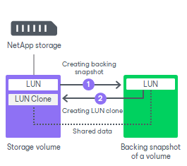
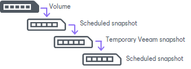

# Traditional LUN Cloning

[For VMware, Veeam Agent integration] For NetApp storage systems that do not have a FlexClone license installed, Veeam Backup & Replication uses the NetApp traditional LUN cloning technology.

Traditional LUN clones are created with the help of a backing snapshot.

1. Veeam Backup & Replication creates a backing snapshot for a LUN holding backup data. The backing snapshot is a snapshot of a volume where the LUN is located. The backing snapshot acts as a helper, or medium, for the LUN clone. It contains a momentary image of the LUN and captures the exact state of the LUN at the necessary point in time.
2. After that, Veeam Backup & Replication creates a LUN clone.

The LUN clone bases on the backing snapshot and shares its data with the backing snapshot. Veeam Backup & Replication cannot delete the backing snapshot before the LUN clone is removed. Deletion of the backing snapshot will corrupt the LUN clone.

In case of traditional LUN cloning, backing snapshots created by Veeam Backup & Replication may be locked and may fail to be deleted automatically with cleanup operations. This can happen, for example, if you schedule the NetApp storage system to create daily volume snapshots, and the scheduled operation begins before Veeam Backup & Replication deletes the backing snapshot that was used for backup or replication.

In this situation, the created backing snapshot will become a part of the snapshot chain. The scheduled snapshot and all subsequent snapshots will reference this snapshot, and Veeam Backup & Replication will be unable to remove it. As a result, your retention policy for scheduled snapshots may be disrupted.

To avoid this situation, it is recommended that you install a FlexClone license on the NetApp storage system. In this case, Veeam Backup & Replication will use the FlexClone technology for LUN cloning.

Related Topics

[FlexClone](storage_backup_netapp_flexclone.md)

