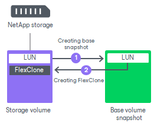

# FlexClone

In this article

[For VMware, Veeam Agent integration] The FlexClone technology lets you create a transparent, space-efficient copy of a LUN. FlexClones are created in seconds and require little space on the storage. Unlike traditional LUN clones, FlexClones are independent and do not cause any problems with volume snapshot deletion.

For backup from storage snapshots, Veeam Backup & Replication creates a FlexClone in the following way:

1. Veeam Backup & Replication creates a temporary snapshot of a volume hosting a LUN to capture the momentary state of this LUN.
2. After that, Veeam Backup & Replication creates a LUN clone.

This temporary volume snapshot is used as a base for a FlexClone. However, the base snapshot is not tied to the FlexClone, as a backing snapshot in traditional LUN cloning. Veeam Backup & Replication can delete it without any impact for the FlexClone at any time.

Related Topics

[Traditional LUN Cloning](storage_backup_netapp_cloning.md)

Page updated 6/19/2024

Page content applies to build 13.0.1.1071
