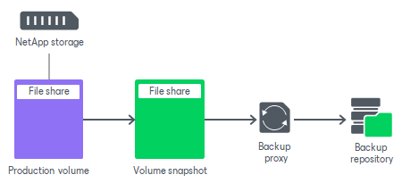

# NFS and SMB (CIFS) Protocols

In this article

[For VMware, NAS integration] If the NetApp storage system operates over SMB (CIFS) (for NAS integration) or over NFS (both for VMware and NAS integration), you do not have to install any additional licenses to use backup from storage snapshots.

For backup from storage snapshots, Veeam Backup & Replication creates a snapshot of a volume on which the file share with backup data resides. The created volume snapshot is used as a source of data. Veeam Backup & Replication uses the client on the proxy and the proxy reads the data from the shared folder storing the volume snapshot.

Requirements for NFS Protocol

Make sure that the following requirements are met:

* [For VMware, NAS integration] NFS access rules (SVM export policies) are created. VBR can create the NFS access rules automatically. You can turn off this option, but in this case make sure the settings are correct.
* [For VMware integration] If you are using a secondary NetApp in backup process, its volumes are mounted (have configured mount path).
* [For VMware, NAS integration] The snapshot directory (.snapshot) is visible in the NFS volumes.

Requirements for SMB (CIFS) Protocol

[For NAS integration] Make sure that the following requirements are met:

* SMB (CIFS) access rules (SVM export policies) are created. VBR can create the SMB access rules automatically. You can turn off this option, but in this case make sure the settings are correct.
* Permissions for access to the SMB share are properly configured. To ensure that, login to your NetApp Ontap System Manager, select the SMB share in Storage – Shares, click Edit to open share settings, and configure permissions in the Permissions tab.
* The snapshot directory (~snapshot) is visible in the SMB share. To ensure that, login to your NetApp Ontap System Manager, select the SMB share in Storage – Shares, click Edit to open share settings, and select the Show Snapshots check box in the Options tab.

Page updated 10/17/2025

Page content applies to build 13.0.1.1071
