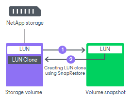

# SnapRestore

[For VMware, Veeam Agent integration] For NetApp storage systems that work in the cDot operating mode and have a SnapRestore license installed, Veeam Backup & Replication can use the NetApp SnapRestore technology for backup from storage snapshots.

Veeam Backup & Replication creates a storage snapshot in the following way:

1. Veeam Backup & Replication creates a snapshot of a volume holding backup data.
2. Veeam Backup & Replication creates a LUN clone using SnapRestore.

