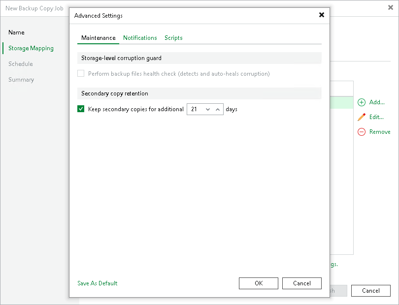

# Maintenance Settings

In the maintenance settings, you can configure whether to perform a health check and specify the secondary copy retention time. Note that the health check may lower the performance of the target repository. For details, see [Health Check for Backup Files](backup_copy_health_check.md#storeonce).

|  |
| --- |
| Note |
| The health check is supported for HPE StoreOnce repositories only. Dell Data Domain repositories do not support the health check. |

1. At the Storage Mapping step of the wizard, click Advanced job settings include notification settings and automated pre/post-job activity settings.
2. In the Keep secondary copies for a minimum of field, specify after which period of time Veeam Backup & Replication will delete files from the target repository once they have been deleted from the source repository.

The storage copy job waits the specified number of days since the backup file was copied to the target repository and then deletes it. If the specified number of days has already passed at the moment of deletion, the storage copy job deletes the backup file immediately.

For example, if the option is set to 30 days and the backup file on the source repository is deleted after 15 days, Veeam Backup & Replication will keep the backup file on the target repository for an additional 15 days.

1. If you want to save this set of settings as the default one, click Save as Default. When you create a new job, the saved settings will be offered as the default. This also applies to all users added to the backup server.

Page updated 2026-07-30

