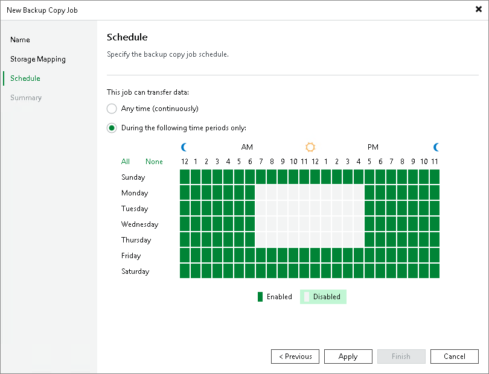

# Step 5. Define Storage Copy Schedule

At the Schedule step of the wizard, you can define a time span in which the storage copy job will transport data between the source and target backup repositories. For more information, see [Backup Copy Window](backup_copy_window.md#immediate).

To define a 'prohibited' period for the storage copy job:

1. Select the During the following time periods only option.
2. In the schedule box, select the desired time area.
3. Use the Enabled and Disabled options to mark the selected time segments as allowed or prohibited for the storage copy job.

Related Topics

[Backup Copy Window](backup_copy_window.md)

Page updated 2026-07-31

