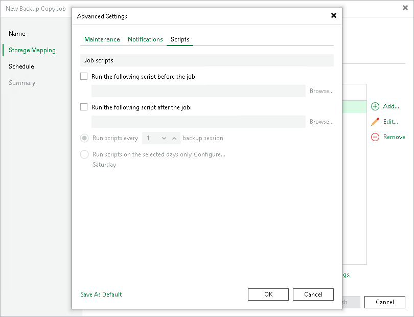

# Script Settings

To specify script settings for the storage copy job:

1. At the Storage Mapping step of the wizard, click Advanced job settings include notification settings and automated pre/post-job activity settings.
2. Click the Scripts tab.
3. Select the Run the following script before the job and Run the following script after the job check boxes to execute custom scripts before and after copying data of each source repository.

Then click Browse and select executable files from a local folder on the backup server. The scripts are executed on the backup server after the copy processes are completed on the target repository.

1. You can change how often the scripts must be executed:

+ To run scripts after a specific number of backup copy sessions, select the Run scripts every... backup session option and specify the number of sessions.
+ To run scripts on specific days, select the Run scripts on selected days only option and click the Days button to specify week days.

|  |
| --- |
| Note |
| If you select the Run scripts on the selected days only option, Veeam Backup & Replication executes scripts only once on each selected day — when the job runs for the first time. During subsequent job runs, scripts are not executed. |

Page updated 2026-07-30

