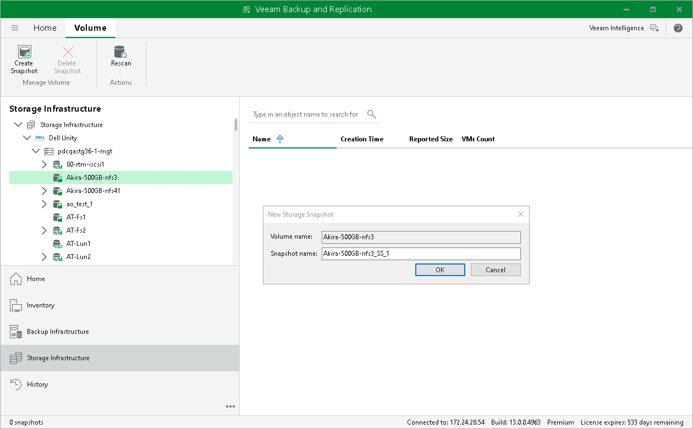
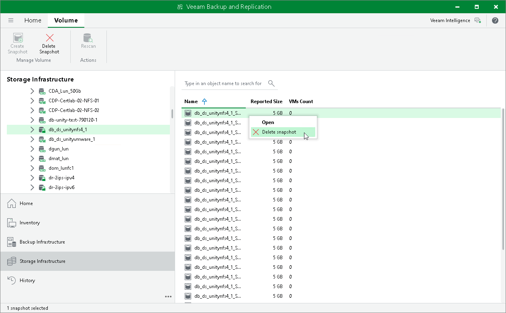

# Creating and Deleting Snapshots Manually

You can create and delete storage snapshots in the Veeam Backup & Replication console. The create and delete snapshot operations do not differ from operations that you perform in the management console of the storage system.

Creating Snapshots

To create a volume snapshot:

1. Open the Storage Infrastructure view.
2. In the inventory pane, expand the storage system tree.
3. Right-click the necessary volume and select Create Snapshot.
4. In the New Storage Snapshot window, specify a name for the created snapshot and provide a description for the snapshot (if the snapshot description field is available).

|  |
| --- |
| Note |
| Consider the following:   * [Cisco HyperFlex HX-Series] You cannot create or delete snapshot manually.  * [For storage systems with synchronous replication] Veeam Backup & Replication does not trigger a storage system to replicate snapshots created manually. However, the storage system itself can replicate the snapshot. |

Deleting Snapshots

To delete a volume snapshot:

1. Open the Storage Infrastructure view.
2. In the inventory pane, expand the storage system tree.
3. Right-click the necessary snapshot and select Delete snapshot.

