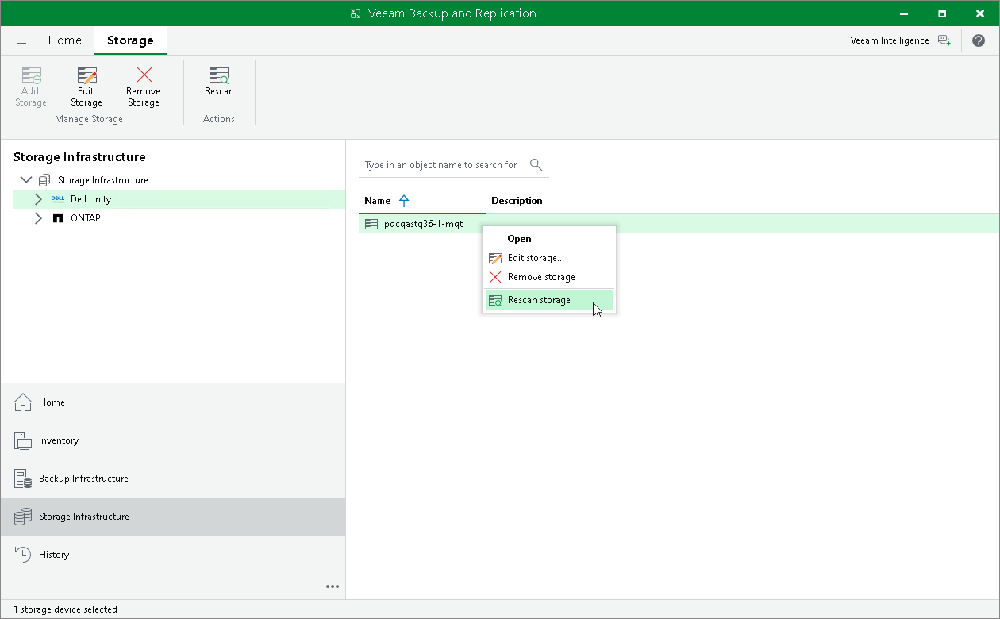

# Rescan (Storage Discovery) Process

The Storage Discovery process performs rescan of the whole storage system or selected volumes. It can be performed against the following nodes in the storage system hierarchy:

* Vendor
* Storage system
* Storage volume

If you have limited rescan scope, storage discovery will be performed only for the specified volumes. For details, see [Limiting Rescan Scope](storage_rescan.md#limit_rescan).

|  |
| --- |
| Note |
| If only Veeam Agents or NAS backup processing is selected for a storage system, storage volumes are not displayed and rescan of the specified volumes is not available. |

Veeam iSCSI Initiator (VMware Integration)

During the rescan of storage systems connected using the iSCSI protocol, Veeam Backup & Replication uses Veeam iSCSI initiator on the proxy. Veeam Backup & Replication automatically creates the initiator and connects it with the storage iSCSI target.

If a server/host is not created on the iSCSI target (storage system), Veeam Backup & Replication creates it. If the server/host with the Veeam iSCSI IQN already exists on the storage system, Veeam Backup & Replication uses this server/host.

To obtain the Veeam iSCSI IQN, launch Storage Discovery. In the discovery session, you can find the Veeam iSCSI IQN.

Stages of Rescan

1. [For VMware, NAS, Veeam Agent integration] General infrastructure

Receiving storage system information.

1. Defining the storage system data hierarchy (volumes, shares, LUNs, snapshots).
2. Getting the information about each volume added to rescan scope (name, ID, size, SCSI Unique ID for LUNs, local paths for shares).
3. Defining basic information about storage snapshots (name, id, creation time).
4. Getting information about storage adapters (targets).
5. Receiving other relevant information.

1. [For VMware, NAS, Veeam Agent integration] Availability from proxies

Verifying the possibility of using proxies for backup/rescan/data transmission directly from the storage systems.

1. Analyzing the selected proxies and checking iSCSI/NFS/SMB servers availability from these proxies.
2. Matching proxies with available servers. The LUNs/share files available from these servers are considered available from the relevant proxies.

Availability through Fibre Channel is not checked. If a proxy is added to a storage system list, the access is considered set.

1. [For VMware integration] vCenter/ESXi rescan

1. Identifying the list of vCenter/ESXi datastores added to Veeam Backup & Replication.
2. Matching the vCenter/ESXi datastores with volumes (LUNs/share files) added to Veeam Backup & Replication. Making the list of VMs located on datastores.
3. Creating/updating information files for the VMs in the snapshots of relevant volumes.

If the VMFS/NFS rescan has not been executed for a volume earlier, we assume that all the snapshots of the volume are for those VMs that have been in the datastore at the moment of rescan.

If the VMFS/NFS rescan has been executed for a volume earlier, Veeam Backup & Replication skips the next step (updating the VMware hosts information for each VM).

1. Updating the VMware hosts information for each VM.

1. [For VMware integration] VMFS/NFS rescan

Scanning the snapshot file system. If the storage system is connected using the iSCSI protocol, Veeam Backup & Replication uses Veeam iSCSI initiator for rescan.

1. Creating storage snapshot clones.

If a storage system can export snapshots directly to a proxy, snapshot clones are not created.

1. Exporting storage snapshot clones to the proxy.
2. Identifying the snapshot file system type.
3. If the snapshot file system type corresponds with VMFS or NFS, Veeam Backup & Replication searches for the VMX files located in the snapshots.

Thus, the system identifies the VMs located in the snapshots. If this stage has not been performed for these snapshots earlier, the snapshot content shown in Veeam Backup & Replication may be changed at this stage: some VMs may be added or deleted.

1. Defining the VMs size.
2. Removing the storage snapshot clones from the proxy.
3. Deleting the storage snapshot clones.

|  |
| --- |
| Note |
| Consider the following:   * Veeam Backup & Replication performs VMFS/NFS rescan of a snapshot only once as snapshots do not change. * If rescan was launched automatically and vCenter/ESXi rescan was performed, VMFS/NFS rescan is skipped. If vCenter/ESXi rescan is not possible, VMFS/NFS rescan is performed for snapshots that were not scanned yet. * If you launch rescan manually or create a snapshot manually, VMFS/NFS rescan is performed for snapshots that were not scanned yet. |

How to Launch Storage Discovery

The following actions and processes initiate the Storage Discovery process:

* Storage Monitor

The Storage Monitor process runs in the background. Every 10 minutes the process checks:

* Appearance or removal of snapshots in the supervised volumes
* Changes in the snapshot names in the supervised volumes
* Changes in the name of the supervised volume itself
* Appearance or removal of volumes (including changes due to alteration in the rescan scope Volumes to scan)

If changes are detected, the Storage Monitor initiates the rescan of the container entity, including all rescan stages except VMFS/NFS rescan:

* Alteration in a snapshot starts rescan of the volume
* Alteration in a volume starts rescan of the storage system

If more than 30% of the volumes need to be rescanned, the Storage Monitor starts rescan of the whole storage system.

* Automatic storage rescan

Rescan of all storage systems, including all rescan stages except VMFS/NFS rescan, starts once a week.

* [For VMware integration] Adding vCenter Server/ESXi

Rescan of all storage systems without VMFS/NFS Rescan.

* Adding a proxy

Rescan of all storage systems without vCenter/ESXi and VMFS/NFS Rescan.

* Starting Veeam Backup Service

Rescan of all storage systems.

* Adding a storage system as a NAS filer

Rescan of storage systems with NAS integration.

* Selecting the Run the storage infrastructure rescan when I click Finish check box in the wizard for adding a storage systems

Rescan of the added storage system, all stages except VMFS/NFS rescan.

* Manual storage rescan

If necessary, you can start the Storage Discovery process manually. Storage discovery can be performed against the following nodes in the storage system hierarchy: vendor, storage system or storage volume.

To manually start storage discovery:

1. Open the Storage Infrastructure view.
2. In the inventory pane, expand the storage system tree.
3. Select a node in the storage system hierarchy: vendor, storage system or volume.
4. Click Rescan on the ribbon or right-click the node in the hierarchy and select Rescan storage or Rescan volume.

|  |
| --- |
| Important |
| The rescan operation is performed only for volumes included in the rescan scope. For information on how to change the rescan scope, see [Limiting Rescan Scope](storage_rescan.md#limit_rescan). |

