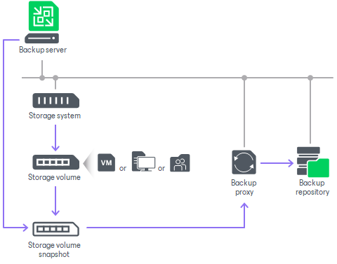

# Infrastructure Overview (Storage Systems)

In this article

Infrastructure for storage integration includes the following components:

* [Backup sever](#backup_server)
* [Storage system](#storage_sys)
* [Proxy](#proxy)
* [Backup repository](#repo)

Backup Server

The backup server is the configuration, administration and management core of the backup infrastructure. The backup server coordinates data transfer tasks and controls resource allocation. For more information on the backup server, see the [Backup Server](backup_server.md) section in the Veeam Backup & Replication Guide.

Storage System

Storage systems are systems designed to store and maintain data. These systems create snapshots, which Veeam Backup & Replication uses to create backups and reduce the workload on the production site.

Depending on the integration type you use, you can add different storage systems to your infrastructure. To learn which storage systems are supported for which integrations, see [System Requirements](storage_system_requirements.md).

To learn how to add storage systems, see [Configuring Storage Systems](storage_setup.md).

Proxy

Veeam Backup & Replication requires proxies for [rescan of storage snapshots](storage_discovery_process.md) in case of VMware integration (see step 4) and backup from storage snapshots in case of all integrations. When Veeam Backup & Replication performs rescan and backup operations, it needs to read the content of storage snapshots. To do this, Veeam Backup & Replication uses the proxy as a helper. Storage snapshots are mounted as new devices or shares to the proxy. As a result, Veeam Backup & Replication can access mounted snapshots over the proxy and read data from them.

Veeam Backup & Replication uses different proxies depending on the integration type:

* For VMware integration, Veeam Backup & Replication uses VMware backup proxies.

To learn how to add proxies, see the [VMware Backup Proxies](backup_proxy.md) section in the Veeam Backup & Replication Guide.

* For NAS and Veeam Agent integrations, Veeam Backup & Replication uses general-purpose backup proxies.

For more information on these proxies and how to add them, see the [General-Purpose Backup Proxies](backup_proxy_general.md) section in the Veeam Backup & Replication Guide.

Before adding proxies, check [Requirements for Proxies](storage_configure_proxy.md).

Backup Repository

A backup repository is a storage location where Veeam Backup & Replication keeps all versions of backups for the configured period. Backups stored in the backup repository can be used to quickly restore VMs, computers or file shares to the state as of a specific restore point. For more information on backup repositories, see the [Backup Repositories](backup_repository.md) section in the Veeam Backup & Replication Guide.

Related Topics

[Planning and Preparation](storage_limitations.md)

Page updated 4/17/2025

Page content applies to build 13.0.1.1071
