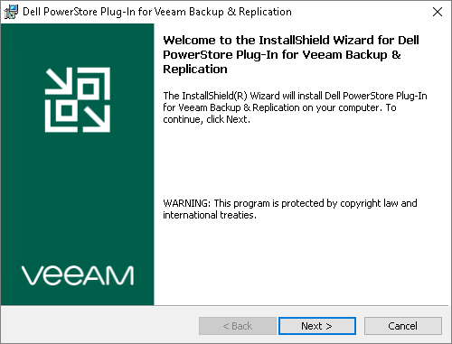
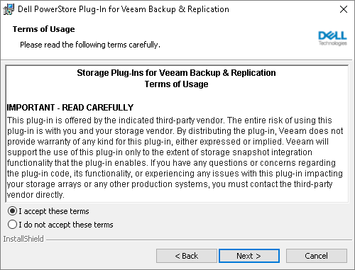
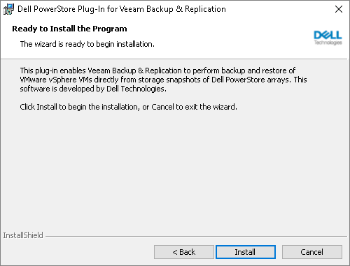

# Installing Plug-Ins on Microsoft Windows-Based Backup Server

[The following information applies to the Microsoft Windows-based backup server.]

Before you start working with Universal Storage API integrated systems, make sure you have installed the Universal Storage API integrated system plug-in on the Veeam backup server.

To install the plug-in, perform the following steps:

1. Download the required Universal Storage API integrated system plug-in from the [Veeam Download page](https://www.veeam.com/backup-replication-vcp-download.html).
2. Run the plug-in installation file.
3. On the welcome screen of the setup wizard click the Next button to proceed to the installation configuration.

1. At the Terms of Usage step of the wizard, select I accept these terms.

1. At the Ready to Install the Program step of the wizard, click Install to begin installation.

1. When the installation process completes, click Finish to close the wizard.

After you install the plug-in, you must configure the backup infrastructure to be able to use storage snapshots for data protection. For more information, see [Infrastructure Overview](storage_infrastructure.md).

Related Topics

* [Infrastructure Overview](storage_infrastructure.md)
* [Backup & Replication Console](backup_console.md)

