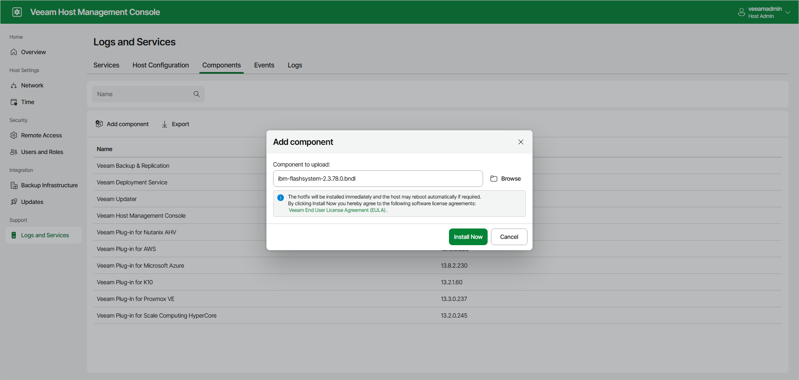
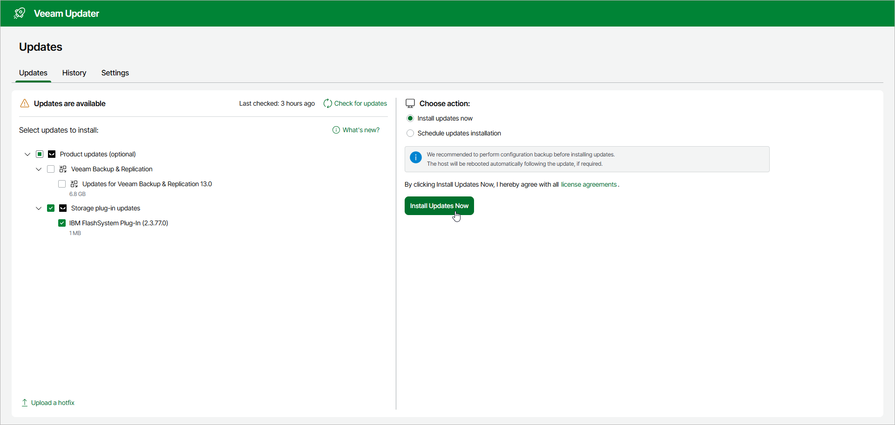

# Installing and Updating Plug-Ins on Linux-Based Backup Server

[The following information applies to the Linux-based backup server.]

Before you start working with Universal Storage API integrated systems, make sure you have installed the Universal Storage API integrated system plug-in on the Veeam backup server.

Installing Plug-In

To install a plug-in, do the following:

1. Download a bundle of the required Universal Storage API integrated system plug-in from the [Veeam Download page](https://www.veeam.com/backup-replication-vcp-download.html).

Download the bundle to the computer from which you will access the Web UI. Choose the plug-in available for Veeam backup server installed on Linux.

1. Open the Veeam Host Management console as described in [Accessing Veeam Host Management Console](hmc_access.md).
2. In the management pane, click Logs and Services.
3. Switch to the Components tab.
4. Click Add Component.
5. In the Add component window, upload and install the plug-in bundle:

1. Browse for the bundle downloaded at step 1.
2. Click Upload.
3. Click Install Now.

After the installation finishes, the plug-in appears in the list of available components.

After you install the plug-in, you must configure the backup infrastructure to be able to use storage snapshots for data protection. For more information, see [Infrastructure Overview](storage_infrastructure.md).

Updating Plug-in

To check if any updates are available and install them:

1. Open the Veeam Updater page.

In a browser, go to Veeam Updater using the following address: https://<backup\_server\_ip>/updater/updates.

Alternatively, you can open Veeam Updater from the Web UI:

1. In a browser, go to https://<backup\_server\_ip>.
2. Log in using the credentials for your Veeam Backup & Replication server.
3. Navigate to the Configuration page.
4. Switch to the About tab.

1. Click Updater Interface.

1. On the Veeam Updater page, select the required plug-in from the list of available updates and click Install Updates Now.

Related Topics

* [Infrastructure Overview](storage_infrastructure.md)
* [Backup & Replication Console](backup_console.md)

