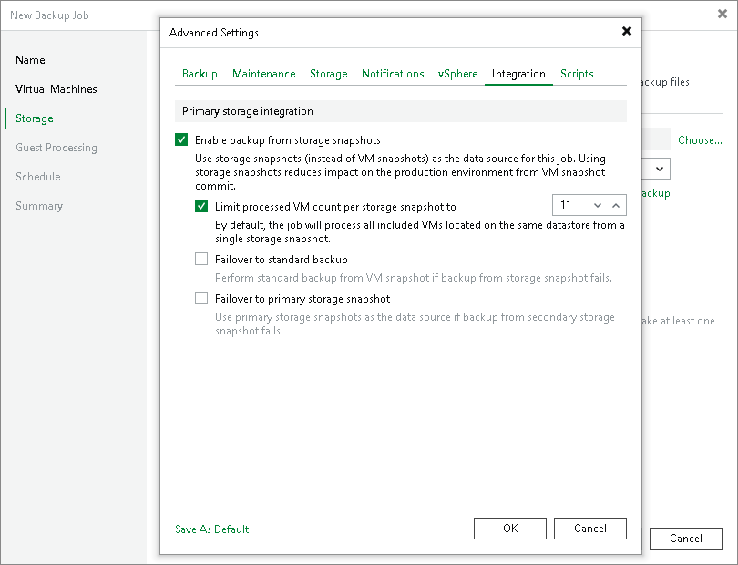

# Limitation on Number of VMs per Snapshot

In this article

By default, during backup from storage snapshots Veeam Backup & Replication creates VMware snapshots for all VMs defined in the backup job that reside on the same volume or LUN, and then triggers a storage snapshot for this volume or LUN. The more VMs reside on the volume or LUN, the more time the VMware snapshots are stored and the more load is produced on the ESXi host. To reduce the lifetime of VMware snapshots and lower the load on the host, limit the number of VMs processed at a time.

To process VMs in chunks, enable the Limit processed VM count per storage snapshot to <N> option and specify the number of VMs processed at a time.

How Limitation Works

With the limitation option enabled, Veeam Backup & Replication processes VMs in several cycles:

1. Veeam Backup & Replication divides VMs into several groups, as defined in the Limit processed VM count per storage snapshot to <N> option.
2. Veeam Backup & Replication triggers VMware snapshots for VMs in the first group.
3. Veeam Backup & Replication triggers a storage snapshot for the volume or LUN where the VMs are hosted.
4. Veeam Backup & Replication deletes VMware snapshots for the VMs in the first group.
5. Veeam Backup & Replication copies data of VMs in the first group from the storage snapshot.
6. Veeam Backup & Replication removes the storage snapshot.
7. Steps 2-6 are repeated for every remaining group of VMs.

For example, you add to the job 15 VMs whose disks are hosted on the same volume and set the Limit processed VM count per storage snapshot to <N> option to 10. Veeam Backup & Replication will divide all VMs into 2 groups — a group of 10 VMs and group of 5 VMs. Veeam Backup & Replication will perform the data processing cycle for the first group of VMs. When VM data processing is over, Veeam Backup & Replication will start processing the second group of VMs.

Related Topics

* [Configuring Backup from Storage Snapshots](storage_backup.md)
* [Configuring Backup from Snapshots on Secondary Storage Arrays](storage_secondary_backup_perform.md)

Page updated 2/14/2025

Page content applies to build 13.0.1.1071
