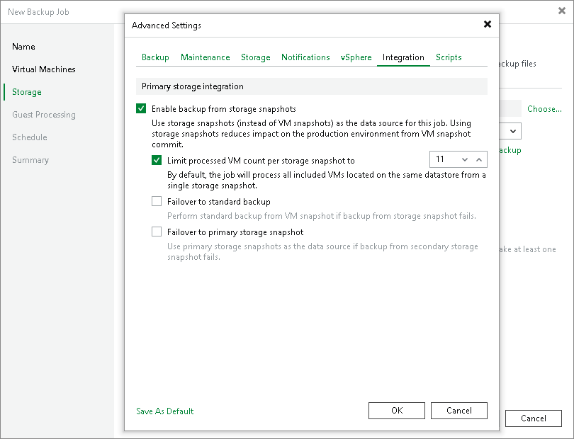

# Limitation on Number of VMs per Snapshot

By default, during backup from storage snapshots Veeam Backup & Replication creates VMware snapshots for all VMs defined in the backup job that reside on the same volume or LUN, and then triggers a storage snapshot for this volume or LUN. The more VMs reside on the volume or LUN, the more time the VMware snapshots are stored and the more load is produced on the ESXi host. To reduce the lifetime of VMware snapshots and lower the load on the host, limit the number of VMs processed at a time.

To process VMs in batches, enable the Limit processed VM count per storage snapshot to <N> option and specify the number of VMs processed at a time.

How Limitation Works

With the limitation option enabled, Veeam Backup & Replication processes VMs within groups in the following way:

1. Veeam Backup & Replication divides VMs in a group into several batches, as defined in the Limit processed VM count per storage snapshot to <N> option.
2. Veeam Backup & Replication processes the batches in parallel. For each batch, Veeam Backup & Replication does the following:

1. Veeam Backup & Replication triggers VMware snapshots for VMs in a batch.
2. Veeam Backup & Replication triggers a storage snapshot for the volume or LUN where the VMs are hosted.
3. Veeam Backup & Replication deletes VMware snapshots for the VMs in the batch.
4. Veeam Backup & Replication copies data of VMs in the batch from the storage snapshot.
5. Veeam Backup & Replication removes the storage snapshot.

For example, a job processes 15 VMs whose disks reside on the same volume, so Veeam Backup & Replication places them in one group. You set the Limit processed VM count per storage snapshot to <N> option to 10. Veeam Backup & Replication divides this group into two batches — a batch of 10 VMs and a batch of 5 VMs — and processes the batches in parallel. If the job also contains VMs on other volumes, they form separate groups, which Veeam Backup & Replication processes in parallel as well.

Related Topics

* [Configuring Backup from Storage Snapshots](storage_backup.md)
* [Configuring Backup from Snapshots on Secondary Storage Arrays](storage_secondary_backup_perform.md)

Page updated 2026-06-17

