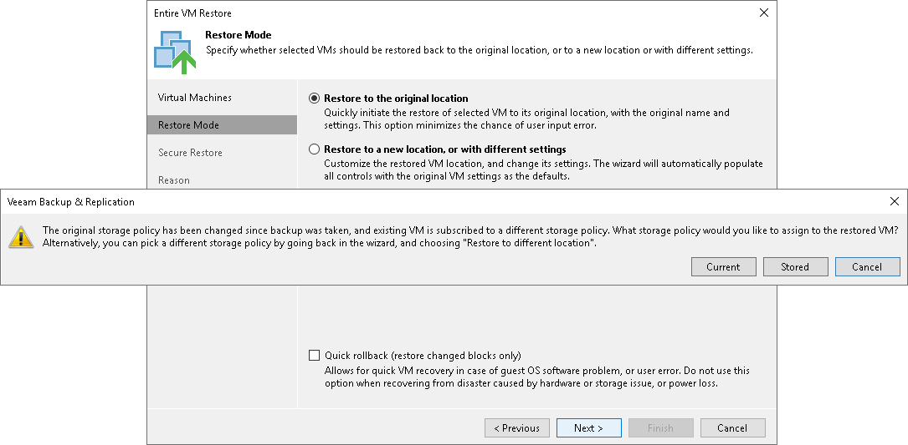

# Storage Profiles

During backup, Veeam Backup & Replication preserves information about the storage policy associated with the VM, and stores this information to the backup file or replica metadata. When you restore the VM to its original location, Veeam Backup & Replication also restores information about the VM storage policy. The restored VM gets automatically associated with the original storage policy.

Veeam Backup & Replication restores the storage policy when you perform the following operations:

* Entire VM restore
* VM failback

Veeam Backup & Replication restores the storage policy only if you restore the VM to the original location. If you restore the VM to a new location, Veeam Backup & Replication does not preserve the storage policy for the VM.

In some cases, the original storage policy may be changed or missing by the time when you restore the VM. For example, the storage policy may be deleted, the original VM in the production environment may be associated with another storage policy and so on. In such situation, Veeam Backup & Replication displays a warning and lets you choose one of the following scenarios:

* Associate the VM with the current storage policy — the restored VM will be associated with the profile with which the original VM in the production environment is currently associated.
* Associate the VM with the default storage policy — the restored VM will be associated with the profile that is set as default for the target datastore.
* Associate the VM with the profile stored in the backup file — the restored VM will be associated with the profile that was assigned to the original VM at the moment of backup, and whose information is stored in the backup file.

Related Topics

* [Entire VM Restore](full_recovery.md)
* [Failback](failback.md)

