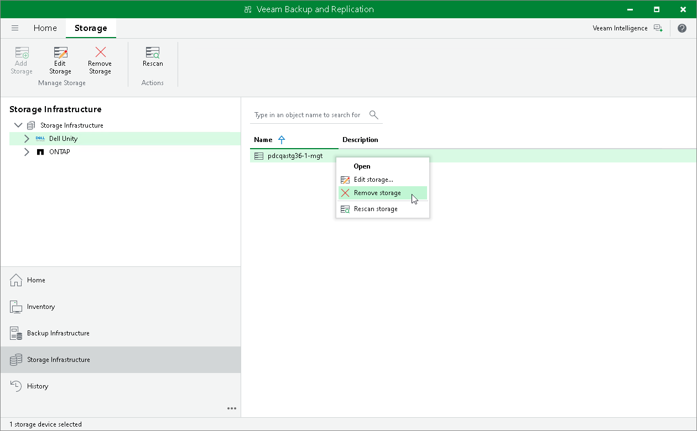

# Removing Storage Systems

You can remove a storage system from the backup infrastructure.

Consider the following:

* When you remove a storage system from the backup infrastructure, Veeam Backup & Replication also finds and removes service objects created by Veeam Backup & Replication on the storage system, for example, hosts and snapshots with "VeeamAUX" in names.
* [For VMware integration] You cannot remove a storage system from the backup infrastructure if you have snapshot jobs or backup jobs with the Secondary Target settings configured for this storage system. You must delete the jobs first.

To remove a storage system:

1. Open the Storage Infrastructure view.
2. In the inventory pane or in the working area, right-click the storage system and select Remove storage.

