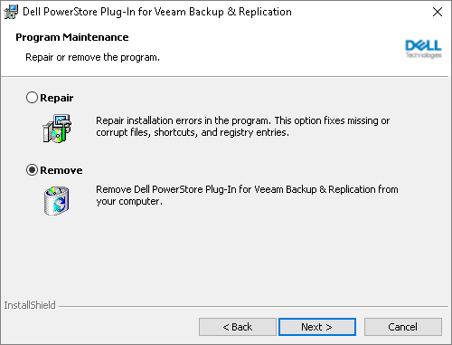

# Uninstalling Plug-Ins from Microsoft Windows-Based Backup Server

In this article

[The following information applies to the Microsoft Windows-based backup server.]

Before you uninstall a Universal Storage API integrated system plug-in, you need to remove from the backup infrastructure the storage systems for which the plug-in was installed. To learn how to remove storage systems, see [Removing Storage Systems](storage_remove.md).

If you do not remove the storage systems beforehand, all information connected to them will still be present in the Veeam Backup & Replication configuration database: you will see snapshots, jobs and so on. However, the storage systems themselves will not be visible in the UI, and you will not able to perform any operations with them. If you reinstall the plug-in, you will be able to perform the operations once again.

To uninstall a Universal Storage API integrated system plug-in:

1. Launch the plug-in installation EXE file.
2. In the wizard, proceed to the Program Maintenance Mode step.
3. Select Remove.
4. Proceed to the final step of the wizard and click Remove.

Alternatively, you can navigate to Control Panel > Programs > Programs and Features. In the list of installed programs, right-click the necessary plug-in and select Uninstall.

Page updated 11/14/2025

Page content applies to build 13.0.1.1071
