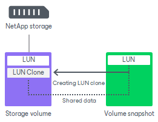

# Traditional LUN Cloning

In this article

For NetApp storage systems that do not have the FlexClone license installed, Veeam Backup & Replication uses the NetApp traditional LUN cloning technology.

During restore from storage snapshots, Veeam Backup & Replication creates a LUN clone. The storage snapshot from which you want to restore data is used as a backing copy. The LUN clone is then mounted to an ESXi host, and you can restore VM data from it.

Page updated 4/16/2025

Page content applies to build 13.0.1.1071
