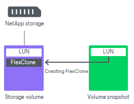

# FlexClone

For NetApp storage systems that have a FlexClone license installed, Veeam Backup & Replication uses the NetApp FlexClone technology for restore from storage snapshots.

During restore from storage snapshots, Veeam Backup & Replication creates a FlexClone of a LUN. The storage snapshot from which you want to restore data is used as a base copy. The FlexClone is then mounted to an ESXi host, and you can restore the necessary VM data from it.

