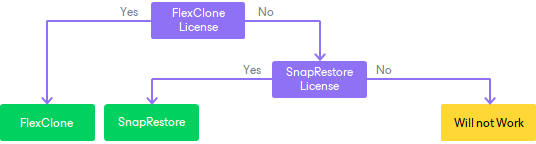

# NFS Protocol

When you perform restore from storage snapshot on NetApp storage systems working over the NFS protocol, Veeam Backup & Replication triggers NetApp to clone an NFS share that holds VM data. NetApp creates a copy of the NFS share and places this copy on the same volume where the original NFS share is located. This copy is used as a data source for restore operations.

After a copy of the NFS share is created, Veeam Backup & Replication mounts the NFS share copy to an ESXi host as a new datastore, and you can restore VM data from the mounted NFS share copy.

If you have several VMs that reside on the same storage snapshot, Veeam Backup & Replication will create only one NFS datastore per snapshot. During restore, VMs from the same snapshot are copied to the same folder on the volume where the original NFS share is located. When you start the restore process for the first VM on the storage snapshot, the folder is presented as a datastore to an ESXi host. After you finish the restore process for the last VM on the storage snapshot, the folder is unmounted from the ESXi host.

Depending on whether you restore from a primary or secondary storage system, the operation mode of the NetApp storage system, Veeam Backup & Replication uses different technologies to create a clone of an NFS share.

Cloning Primary Storage System (cDot)

If the NetApp storage system operates in the cDot mode, you must have a FlexClone or SnapRestore license installed.

* If you have a FlexClone license installed, Veeam Backup & Replication uses the FlexClone technology.
* If you have a SnapRestore license installed, Veeam Backup & Replication uses the SnapRestore technology.

* If neither FlexClone nor SnapRestore license is installed, VM data restore will fail.

Cloning Secondary Storage System

Cloning SnapVault (cDot)

If the NetApp storage system operates in the cDot, you must have a FlexClone license installed. In the opposite case, VM data restore will fail.

Cloning SnapMirror (cDot)

If the NetApp storage system operates in cDot, you must have a FlexClone license installed. In the opposite case, VM data restore will fail.

|  |
| --- |
| Important |
| [For Instant Recovery] If you restore data from ONTAP SnapMirror, Veeam Backup & Replication performs actual Instant Recovery only if a FlexClone license is installed. If the NDMP protocol is enabled, Veeam Backup & Replication performs entire VM restore instead of Instant Recovery. As a result, the restore process takes more time and may fail due to exceeding the default protocol timeout. |

