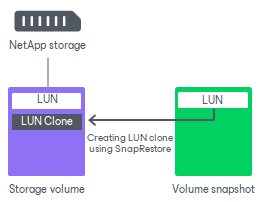

# SnapRestore

In this article

For NetApp storage systems that have a SnapRestore license installed, Veeam Backup & Replication uses the NetApp SnapRestore technology for restore from storage snapshots.

When you restore data from storage snapshot, Veeam Backup & Replication triggers NetApp to create a clone of a LUN using SnapRestore. To do this, NetApp restores LUN data to a new location on the volume where the original LUN is located. As a result, you have a read-write copy of the LUN holding VM data, and can use this copy for restore operations.

Page updated 8/4/2023

Page content applies to build 13.0.1.1071
