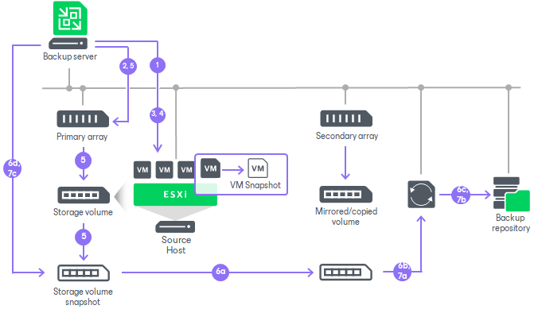

# Backup from Secondary Storage Arrays

If the primary storage array is associated with a secondary storage array, you can use the secondary storage array as a data source for backup. Backup from snapshots on secondary storage arrays reduces impact on the production storage. During backup, operations on VM data reading are performed on the side of the secondary storage array, and the primary storage array is not affected. For information on the supported secondary storage array features and terms for them in Veeam Backup & Replication, see [Secondary Storage Array Features and Veeam Backup & Replication Terms](supported_features.md#terms).

How Backup from Secondary Storage Systems Works

Backup from snapshots on secondary storage arrays is similar to backup from storage snapshots on the primary storage array. The algorithm slightly differs for snapshot transfer and synchronous replication.

1. Veeam Backup & Replication analyzes which VMs in the job host their disks on the storage system and checks the backup infrastructure to detect if there is a backup proxy that has a direct connection to the storage system.
2. Veeam Backup & Replication detects whether the storage system uses synchronous replication or snapshot transfer, and whether backup from secondary storage array is possible.
3. Veeam Backup & Replication triggers a VMware snapshot for a VM whose disks are hosted on the primary storage array.
4. Veeam Backup & Replication requests the ESXi host to retrieve metadata about the layout of VM disks (physical addresses of data blocks) and also gets Changed Block Tracking (CBT) information for VMs hosted on the storage system.
5. Veeam Backup & Replication instructs the storage system to create a temporary storage snapshot. If snapshot transfer is used — on the primary storage array. If synchronous replication — on the primary and secondary storage arrays. However, only snapshot on the secondary storage array will be used.

The created temporary snapshots capture the VMware vSphere VM snapshot. The VMware vSphere VM snapshot is then deleted.

1. [For snapshot transfer] The following steps apply if snapshot transfer is detected:

1. The temporary storage snapshot is transferred from the primary storage array to the secondary storage array.
2. The transferred temporary storage snapshot is mounted to the detected backup proxy.
3. The backup job retrieves VM data from the mounted temporary storage snapshot.
4. When the job finishes processing the VM, Veeam Backup & Replication instructs the storage system to delete the temporary snapshot on the primary storage array. The transported snapshot on the secondary storage becomes long-term snapshot and remains in the snapshot chain until it is removed by the retention policy.

1. [For synchronous replication] The following steps apply if synchronous replication is detected:

1. The created temporary storage snapshot is mounted to the detected backup proxy.
2. The backup job retrieves VM data from the mounted temporary storage snapshot.
3. When the job finishes processing the VM, Veeam Backup & Replication instructs the storage system to delete the temporary snapshot on the primary and secondary storage arrays.

Note the following:

* [For HPE Alletra 5000, 6000, Nimble] On HPE Alletra 5000, 6000, Nimble storage systems, snapshot transport is triggered as soon as you create a new storage snapshot. For this reason, launch of snapshot transport and deletion of VMware snapshots are performed in parallel.
* [For NetApp ONTAP, Fujitsu ETERNUS HX/AX, Lenovo ThinkSystem DM/DG and HPE Alletra 5000, 6000, Nimble] Veeam Backup & Replication creates auxiliary snapshots on the primary storage system. The number of storage snapshots in the snapshot chain cannot be fewer than 1.

Failover to Backup from Snapshots on Primary Storage Arrays

In some cases, Veeam Backup & Replication may fail to back up VM data from temporary storage snapshots on the secondary storage array. This can happen, for example, if Veeam Backup & Replication fails to connect to the secondary storage array or a license required for volume or LUN export is not installed (in case of ONTAP SnapMirror or SnapVault).

To overcome this situation, you can instruct the backup job to fail over to the backup from storage snapshots on the primary storage array. In this case, Veeam Backup & Replication will create a temporary storage snapshot on the primary storage array and attempt to transport it to the secondary storage array. If the transport process fails, Veeam Backup & Replication will retrieve VM data from the created temporary snapshot on the primary storage array. Note, however, that backup from storage snapshots on the primary storage system will produce additional load on the production environment.

To let Veeam Backup & Replication fail over to backup from storage snapshots on the primary storage array, you must enable the Failover to primary storage snapshot option in the backup job settings.

|  |
| --- |
| Note |
| For storage systems with synchronous replication, failover can be used only if the secondary storage array is not detected at the beginning of the job. If the connection with the secondary storage array is lost later, the job will fail. |

Related Topics

[Configuring Backup from Snapshots on Secondary Storage Arrays](storage_secondary_backup_perform.md)

