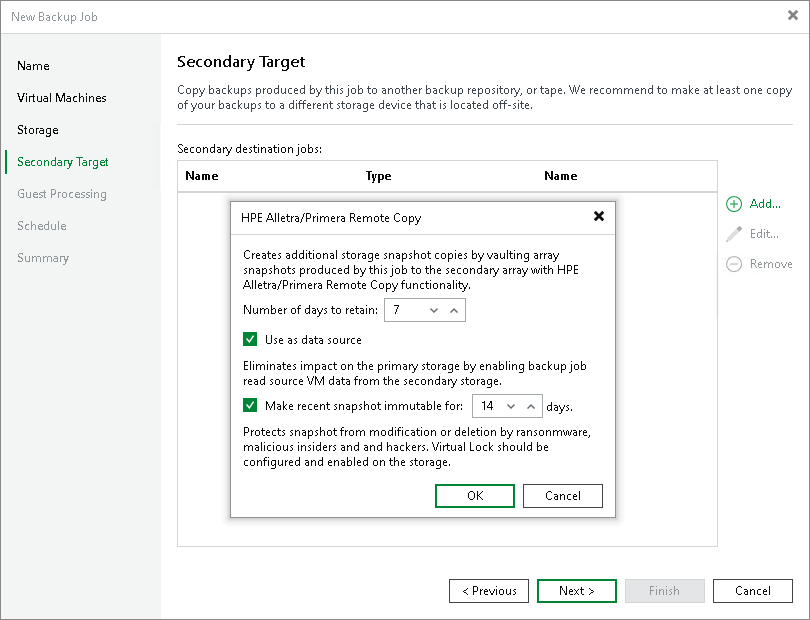

# Configuring Backup from Snapshots on Secondary Storage Arrays

In this article

You can configure a backup job to perform backup from storage snapshots on secondary storage arrays.

Key Job Settings

The key job settings responsible for backup from storage snapshots on secondary storage arrays are:

* At the Storage step of the wizard, the Configure secondary destinations for this job.

* At the Storage step of the wizard, in the Advanced settings, the Enable backup from storage snapshots check box. By default, this option is enabled.

* At the Secondary Target step of the wizard, the added replication feature of a secondary storage array and the Use as data source check box.

Configuring Backup from Snapshots on Secondary Storage Arrays

To back up VMs from snapshots on secondary storage arrays:

1. Open the Home view.
2. Click Backup Job > VMware or vCloud on the ribbon. Veeam Backup & Replication will launch the New Backup Job wizard.
3. At the Name step of the wizard, specify a name and description for the job.
4. At the Virtual Machines step of the wizard, click Add and select VMs whose disks are hosted on the storage system.
5. At the Storage step of the wizard, click Choose and select a backup proxy that will be used for data transfer. You can assign the backup proxy explicitly or choose the automatic mode of backup proxy selection.

|  |
| --- |
| Note |
| A backup proxy that you select must be added to the list of backup proxies in storage system connection settings. If the backup proxy is not added to the list in storage system connection settings, Veeam Backup & Replication may fail over to the regular data processing mode. To switch on the failover, at the Storage step of the backup or replication job wizard, click Advanced and select the Failover to standard backup check box. For more information, see [Adding Storage Systems](storage_configure_add_storage.md). |

1. At the Storage step of the wizard, select a backup repository and configure retention:

1. From the Backup repository drop-down list, select a backup repository where you want to store backup files.
2. In the Retention policy field, specify the number of days for which you want to keep restore points.

1. Enable and configure backup from storage snapshots:

1. At the Storage step of the wizard, click Advanced.
2. In the Advanced Settings window, click the Integration tab.
3. Make sure that the Enable backup from storage snapshots check box is selected.
4. If you add to the job many VMs whose disks are located on the same volume or LUN, select the Limit processed VM count per storage snapshot to <N> check box and specify the number of VMs for which one temporary storage snapshot must be created. Veeam Backup & Replication will divide VMs into several groups and trigger a separate temporary storage snapshot for every VM group. As a result, the job performance will increase. For more information, see [Limitation on Number of VMs per Snapshot](storage_limiting.md).
5. To fail over to the regular backup data processing mode if Veeam Backup & Replication fails to create a temporary storage snapshot, select the Failover to standard backup check box.
6. To fail over to backup from storage snapshots on the primary storage system if Veeam Backup & Replication cannot create a temporary storage snapshot on the secondary storage array, select the Failover to primary storage snapshot check box. For more information, see [Failover to Backup from Snapshots on Primary Storage Arrays](storage_secondary_backup.md#failover).

For information on how to configure other advanced settings, see the [Specify Advanced Backup Settings](backup_job_advanced_vm.md) section in the Veeam Backup & Replication User Guide.

1. To create long-term storage snapshots on the secondary storage array and create backups from them:

1. At the Storage step of the wizard, select the Configure secondary destinations for this job check box.
2. At the Secondary Target step of the wizard, configure a replication feature. You can select the following types of [replication features](supported_features.md):

* Synchronous replication.

If you select a synchronous replication feature, the Use as data source option is enabled by default and cannot be changed. Veeam Backup & Replication will create backups from temporary snapshots created on the secondary storage array, snapshots created on the primary storage array will not be used for backup.

|  |
| --- |
| Note |
| [For synchronous replication] If you do not select an option to create snapshots on the primary storage array at the Secondary Target step and select only the synchronous replication feature, Veeam Backup & Replication will create only temporary snapshots. The snapshot chain (long-term snapshots) will not be created neither on the primary storage array nor on the secondary storage array. To create a snapshot chain, add the option to create snapshots on the primary storage array and configure the Number of snapshot copies to retain field and, if required, the Make recent snapshots immutable for field to prohibit snapshot deletion and modification. In this case, long-term snapshots will be created simultaneously on the primary and secondary storage arrays, that is, coordinated snapshots will be created. Veeam Backup & Replication will retain the same number of snapshots on both storage arrays. |

* Snapshot transfer.

For more information on the storage systems, supported features and required licenses, see [Supported Storage Features for Backup and Orchestration](supported_features.md#feature).

If you select a snapshot transfer feature, Veeam Backup & Replication will also add a snapshot to a snapshot chain. In this case, configure the following:

1. In the Number of days to retain field, specify the number of days for which to retain long-term storage snapshots on the secondary storage array. When this number is exceeded, Veeam Backup & Replication will trigger the storage system to remove the earliest outdated snapshots from the chain.
2. Select the Use as the data source check box to use the secondary storage array as a source for backups.
3. To prohibit deletion and modification of long-term storage snapshots, select the Make recent snapshots immutable for check box. Then specify the immutability period — the duration that snapshots must remain unchanged. If the specified immutability period exceeds the storage system maximum immutability period, it will default to the maximum allowed value.

1. If you want to use snapshot archiving, that is, offload snapshots to a 3rd party storage solution supported by a storage vendor (for example, Amazon S3 storage or NFS target):

1. Check that the Configure secondary destinations for this job check box is selected at the Storage step of the wizard.
2. At the Secondary Target step of the wizard, select an archiving feature.
3. In the Number of days to retain field, specify the number of days for which you want to maintain long-term storage snapshots in the offload target.

For more information on the storage systems, supported features and required licenses, see [Supported Storage Features for Backup and Orchestration](supported_features.md#feature).

1. If you want to configure guest processing, follow the instruction provided in the [Specify Guest Processing Settings](backup_job_vss_vm.md) section in the Veeam Backup & Replication User Guide.
2. At the Schedule step of the wizard, select the Run the job automatically check box and specify the schedule by which storage snapshots must be created. For more information, see the [Define Job Schedule](backup_job_schedule_vm.md) section in the Veeam Backup & Replication User Guide.
3. At the Summary step of the wizard, review settings of the added storage system. Select the Run the job when I click Finish check box if you want to start the job right after you finish working with the wizard. Click Finish to save the backup job settings.

Related Topics

[Backup from Secondary Storage Arrays](storage_secondary_backup.md)

Page updated 10/17/2025

Page content applies to build 13.0.1.1071
