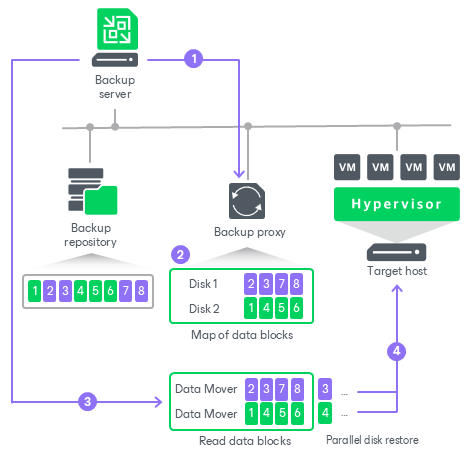

# Accelerated Restore

Accelerated restore is a mechanism that speeds up restore using sequential data reading from backups.

Data blocks of VM disks could be stored in a random order in the backup files. This causes random data reading during traditional restore. Random reading degrades the performance for restore from backups stored on HPE StoreOnce as this storage system is optimized for sequential I/O operations.

To accelerate the restore process, Veeam Backup & Replication creates a map of data blocks in backup files. The map contains references to VM data blocks, sorted by VM disks. Using this map, Veeam Backup & Replication analyzes where data blocks physically reside and reorders read requests to maximize sequential access. Then, Veeam Backup & Replication writes data blocks to the target destination in the order the gateway server reads data from the HPE StoreOnce backup repository.

The accelerated restore mechanism is enabled by default, for the following restore scenarios:

* Entire VM restore to virtualization platforms: [VMware vSphere](full_recovery.md) and [Microsoft Hyper-V](full_recovery_hv.md).
* Restore to cloud platforms: [Microsoft Azure](restore_azure.md), [Amazon EC2](restore_amazon.md) and [Google Compute Engine](restore_google.md).

How Accelerated Restore Works

Restore from backups on HPE StoreOnce is performed in the following way:

1. Veeam Backup & Replication opens all backup files in the backup chain, reads metadata from these backup files and caches this metadata on the gateway server assigned to the backup repository.
2. Veeam Backup & Replication uses the cached metadata to build a map of data blocks. The map contains references to VM data blocks, sorted by VM disks.
3. Veeam Backup & Replication starts one [Veeam Data Mover](veeam_transport_service.md) on the gateway server. This Veeam Data Mover reads data blocks of VM disks from the backup repository sequentially, as these blocks reside on the backup repository. Then it transfers data blocks to the backup proxy. On the backup proxy, these data blocks are put to the buffer.
4. The backup proxy processes each VM disk in a separate task. For each task, Veeam Backup & Replication starts one Veeam Data Mover. This allows writing disk data to the target in multiple threads.
5. Data blocks are written to target in the order in which they come from the gateway server.

Backup Proxy for Accelerated Restore

Veeam Backup & Replication restores all disks of a VM through one backup proxy. In Microsoft Hyper-V environments, the role of a backup proxy is assigned to the target Microsoft Hyper-V host — host to which the VM is restored. In VMware vSphere environments, if you instruct Veeam Backup & Replication to select a backup proxy for the restore task automatically, it picks the least loaded backup proxy in the backup infrastructure. If you assign a backup proxy explicitly, Veeam Backup & Replication uses the selected backup proxy.

Veeam Backup & Replication starts a separate Veeam Data Mover on the backup proxy for each VM disk, plus one Data Mover for all disks. For example, if you restore a VM with 10 disks, Veeam Backup & Replication starts 11 Veeam Data Movers on the backup proxy.

The backup proxy assigned for the task must have enough RAM resources to be able to restore VM disks in parallel. For every VM disk, 200 MB of RAM is required. The total amount of required RAM resources is calculated by the following formula:

|  |
| --- |
| Total amount of RAM = (Number of VM disks + 1) \* 200 MB |

Before starting the restore process, Veeam Backup & Replication checks the amount of RAM resources on the backup proxy. If the backup proxy does not have enough RAM resources, Veeam Backup & Replication displays a warning in the job session details and automatically fails over to a regular VM disks processing mode (data of VM disks is read at random and VM disks are restored sequentially).

Limitations for Accelerated Restore

The accelerated restore has the following limitations:

* Accelerated restore works on HPE StoreOnce systems with Catalyst.
* If you restore a VM with dynamically expanding disks, the restore process may be slow.
* Synthetic full backup can increase the probability of blocks being saved randomly to the deduplicating appliance. This can slow down restore. Instead, you can use the active full backup.
* [For VMware vSphere environments] If you restore a VM using the Network transport mode, the number of VM disks restored in parallel cannot exceed the number of allowed connections to an ESXi host.
* If HPE StoreOnce is added as an extent to a scale-out backup repository, you must set the backup file placement policy to Locality. If the backup file placement policy is set to Performance, parallel VM disk restore will be disabled.

Related Topics

* [Operational Modes](deduplicating_appliance_storeonce_modes.md)
* [HPE StoreOnce Supported Features](storeonce_supported_features.md)
* [Adding Deduplicating Storage Appliances](dsa_repository_add.md)

