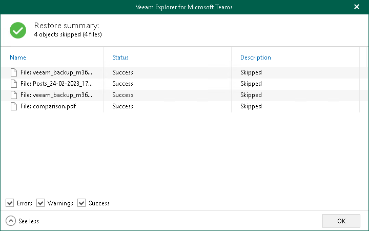

# Step 5. Review Summary

At the Restore summary step, click See more to expand the window and review details of the restore operation and click OK.

You can filter notifications by their status: Error, Warning or Success.

