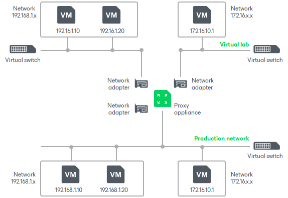

# Advanced Single-Host Virtual Labs

In this article

The advanced single-host virtual lab can be used if VMs that you want to verify and VMs from the application group are connected to different networks.

In the advanced single-host virtual lab, Veeam Backup & Replication creates several virtual networks for the virtual lab. The number of virtual networks corresponds to the number of production networks to which verified VMs are connected. Networks in the virtual lab are mapped to production networks.

Veeam Backup & Replication adds a new virtual switch for every network in the virtual lab. For example, if you have two networks in the production environment, Veeam Backup & Replication will create two networks in the virtual lab and add two virtual switches for every network on the Hyper-V host. The added virtual switches are only used by the VMs started in the virtual lab. There is no routing outside the virtual lab to other networks.

When you create an advanced single-host virtual lab, Veeam Backup & Replication configures basic settings for networks that are created in the virtual lab. You need to review these settings and manually adjust them.

Page updated 5/5/2025

Page content applies to build 13.0.1.1071
