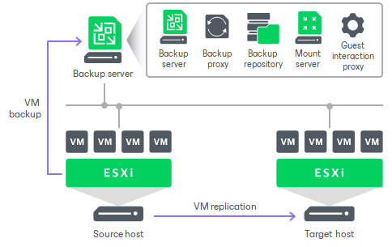

# Basic Single-Host Virtual Labs

In this article

The basic single-host virtual lab can be used if all VMs that you want to verify, VMs from the application group and the backup server are connected to the same network.

For the basic single-host virtual lab, Veeam Backup & Replication creates one virtual network that is mapped to the necessary production network. Veeam Backup & Replication automatically adds a number of new objects on the ESXi host where the virtual lab is created:

* A resource pool
* A VM folder
* A standard vSwitch

The vSwitch is only used by the VMs started in the virtual lab. There is no routing outside the virtual lab to other networks.

Veeam Backup & Replication automatically configures all settings for the basic single-host virtual lab. The proxy appliance is also created and configured automatically on the ESXi host where the virtual lab is created.

Page updated 4/29/2025

Page content applies to build 13.0.1.1071
