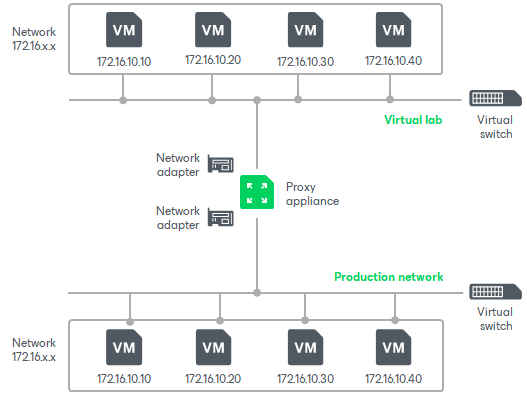

# Basic Single-Host Virtual Labs

The basic single-host virtual lab can be used if all VMs that you want to verify, VMs from the application group and the backup server are connected to the same network.

For the basic single-host virtual lab, Veeam Backup & Replication creates one virtual network that is mapped to the necesary production network. Veeam Backup & Replication adds a new virtual switch for the virtual lab. The added virtual switch is only used by VMs started in the virtual lab. There is no routing outside the virtual lab to other networks.

Veeam Backup & Replication automatically configures all settings for the basic single-host virtual lab. The proxy appliance is also created and configured automatically on the Hyper-V host where the virtual lab is created.

