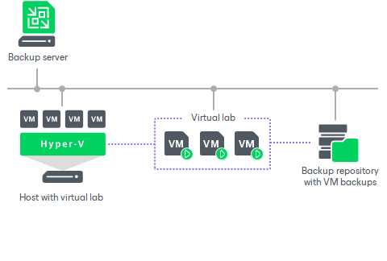

# How SureBackup Works

For SureBackup, Veeam Backup & Replication uses a regular image-based backup. SureBackup job can operate in two different recovery verification modes:

* Full recoverability testing. Veeam Backup & Replication runs machines in an isolated environment directly from backup and performs tests against live applications.This mode ensures recoverability of your production workloads in a disaster recovery event.
* Backup verification and content scan only. Veeam Backup & Replication performs backup integrity check and its content analysis to detect traces of malware or any other unwanted or sensitive data. These tests do not require setting up a virtual lab or an application group.

Full Recoverability Testing

During the full recoverability testing, Veeam Backup & Replication performs the following actions:

1. If the SureBackup job is configured to perform the malware scan, Veeam Backup & Replication scans backups of the machines from the application group and the machine under verification with antivirus software and the specified YARA rule.
2. Veeam Backup & Replication publishes the machines from the application group and the machine under verification in the isolated environment — virtual lab. Machines are started directly from compressed and deduplicated backup files that reside in the backup repository. To achieve this, Veeam Backup & Replication utilizes [Instant Recovery to Microsoft Hyper-V](instant_recovery_to_hv.md).
3. Veeam Backup & Replication performs a number of tests against the machines in the application group and the machine under verification: heartbeat test, ping test and application test.
4. If the SureBackup job is configured to validate backup files, Veeam Backup & Replication performs a cyclic redundancy check for the backup file from which the machine under verification is started and, optionally, for backup files from which the machines in the application group are started. The backup file validation is performed after all verification tests are complete.
5. When the recovery verification process is over, Veeam Backup & Replication unpublishes machines and creates a report on their state. The report is sent to the backup administrator by email.

|  |
| --- |
| Note |
| If the machine has multiple disk partitions with different OS installed, SureBackup will only verify the partition with the highest boot priority. |

During verification, a backed-up machine image remains in read-only state. All changes that take place when the machine is running are written to the differencing disk (AVHD/AVHDX file), created for the recovered machine. When the recovery verification process is complete, the changes are discarded.

To perform recovery verification, you need to create the following objects:

1. [Application group](application_group_hv.md). During recovery verification, the verified machine may need to be started with a group of machines on which it is dependent. The application group enables full functionality of applications running inside the machine and lets you run these applications just like in the production environment.
2. [Virtual lab](virtual_lab_hv.md). The virtual lab is the isolated virtual environment in which the verified machine and machines from the application group are started and tested.
3. [SureBackup job](surebackup_job_hv.md). The SureBackup job is a task to perform recovery verification. You can run the SureBackup job manually or schedule it to run automatically by schedule.

Backup verification and content scan only

During the backup verification and content scan, Veeam Backup & Replication performs the following actions:

1. If the SureBackup job is configured to perform malware scan, Veeam Backup & Replication scans backups of the machines from the linked job with antivirus software and the specified YARA rule.
2. If the SureBackup job is configured to validate backup files, Veeam Backup & Replication performs a cyclic redundancy check for the backup file from which the machine under verification is started. The backup file validation is performed after all verification tests are complete.
3. When the recovery verification process is over, Veeam Backup & Replication creates a report on the machines' state. The report is sent to the backup administrator by email.

During verification, a backed-up machine image remains in read-only state. All changes that take place when the machine is running are written to the differencing disk (AVHD/AVHDX file), created for the recovered machine. When the recovery verification process is complete, the changes are discarded.

