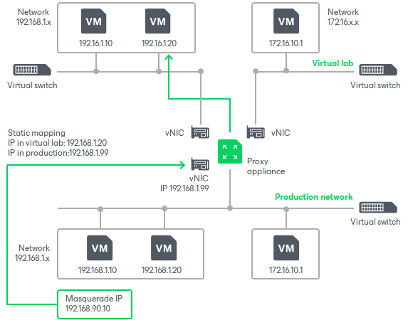

# Static IP Mapping

Sometimes it is necessary to provide many clients with access to a restored VM, which is especially the case for user-directed application item-level recovery. For example, you may want to provide users with access to the Microsoft Exchange Server started in the virtual lab using web-based access (like Outlook Web Access). Technically, you may update the routing table on every client machine; however, this will demand a lot of administrative effort.

For such situations, Veeam Backup & Replication lets you get access to a VM in the virtual lab directly from the production environment. To access a VM in the virtual lab, you must reserve a static IP address in the pool of production IP addresses and map this IP address to the IP address of a VM in the virtual lab.

The static IP address is assigned to the proxy appliance network adapter connected to the production network. IP traffic directed to the specified static IP address is routed by the proxy appliance to the VM in the isolated network.

For example, for a VM with IP address 192.168.1.20 in the isolated network, you can reserve IP address 192.168.1.99 (a free IP address from the production network). As a result, you will be able to use IP address 192.168.1.99 to access the VM in the virtual lab from the production side.

You can also register an alias record in the production DNS server for the reserved IP address. For example, you can register backup.exchange.local as an alias for the IP address 192.168.1.99, and users will be able to access Microsoft Exchange Server by this alias.

