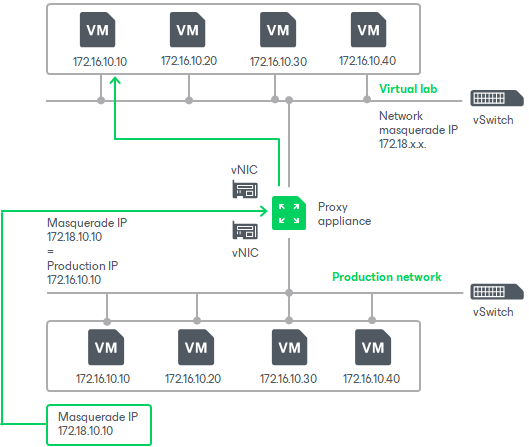
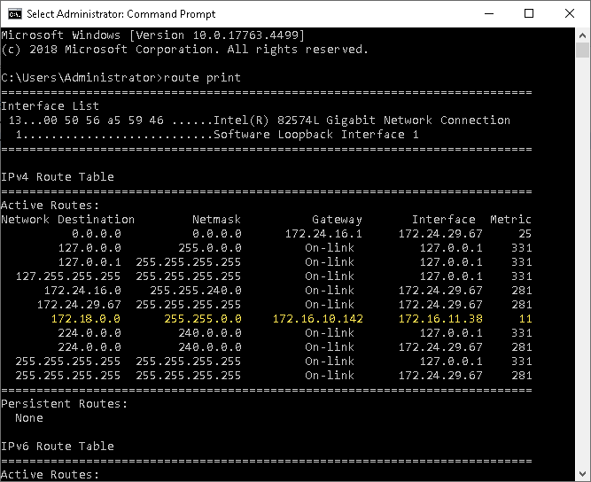

# IP Masquerading

To let the traffic into the virtual lab, Veeam Backup & Replication uses masquerade IP addressing.

Every VM in the virtual lab has a masquerade IP address, along with the IP address from the production network. The masquerade IP address resembles the IP address in the production network. For example, if the IP address of a VM is 172.16.1.13, the masquerade IP address may be 172.18.1.13.

The masquerade IP address is an "entry point" to the VM in the virtual lab from the production environment. When you want to access a specific VM in the virtual lab, Veeam Backup & Replication addresses it by its masquerade IP address.

The rules that route requests to VMs in the virtual lab are specified in the routing table on the server from which you want to access VMs in the virtual lab. The routing table can be updated on the following servers:

* Backup server. Veeam Backup & Replication automatically creates the necessary static routes in the routing table on the backup server at the moment you launch a SureBackup job and Veeam Backup & Replication starts the virtual lab.
* Client machine. If you want to provide your users with access to VMs in the virtual lab, you need to manually update routing tables on their machines and add new static routes. For more information, see [Static IP Mapping](surebackup_ip_mapping.md).

The added static route destines the masquerade network traffic to the proxy appliance. The proxy appliance acts as a NAT device: it resolves the masquerade IP address, replaces it with “real” IP address of the VM from the production network and then directs the request to the necessary VM in the virtual lab. The static route is non-persistent: when you power off the virtual lab, the route is removed from the routing table on the backup server or client machine.

For example, when trying to access a VM with IP address 172.16.10.10 in the isolated network, Veeam Backup & Replication sends a request to the masquerade IP address 172.18.10.10. According to the routing rule added to the IP routing table, all requests are first sent to the next hop — the proxy appliance. The proxy appliance performs address translation, substitutes the masquerade IP address with the IP address in the isolated network, and forwards the request to the necessary VM in the isolated network — in this example, to 172.16.10.10.

