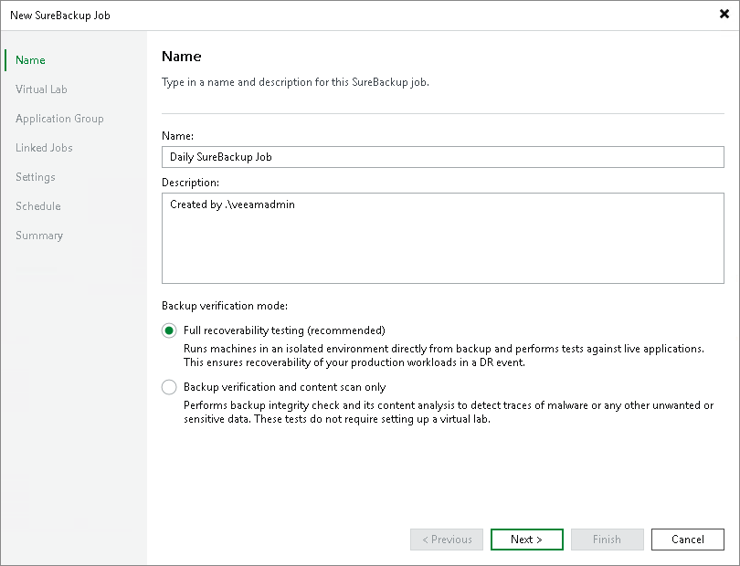
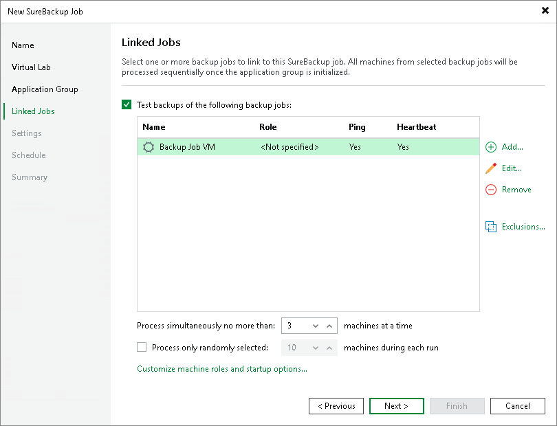

# Creating SureBackup Job

In this article

To create a new SureBackup job, use the New SureBackup Job wizard.

1. On the Home tab, click the SureBackup Job to launch the SureBackup Job wizard.
2. At the Name step of the wizard, specify a name, description and backup verification mode for the SureBackup job.

1. [For full recoverability testing mode] At the Virtual Lab step of the wizard, select or add a virtual lab that Veeam Backup & Replication will use to recover your computer as a VM.

1. [For full recoverability testing mode] At the Application Group step of the wizard, select or add an application group with backups you want to test.

|  |
| --- |
| TIP |
| You can skip this step and add a backup job as a source of backups at the [Linked Jobs](#job_12.1) step of the wizard. |

1. At the Linked Jobs step of the wizard, add a backup job to use as a source of backups for the SureBackup job and specify settings for backup job processing. To learn more, see [Link Backup or Replication Job](https://helpcenter.veeam.com/docs/vbr/userguide/surebackup_job_joblink_vm.html?ver=13#linking-backup-or-replication-job-in-veeam-backup---replication-12-1) and [Specify Recovery Verification Options and Tests](surebackup_job_tests_vm.md).

|  |
| --- |
| TIP |
| [For full recoverability testing mode] You can skip this step if you selected an application group at the [Application Group](#group_12.1) step of the wizard. |

1. At the Settings step of the wizard, specify additional settings for the SureBackup job. To learn more, see [Specify Additional Job Settings](https://helpcenter.veeam.com/docs/vbr/userguide/surebackup_job_settings_vm.html?ver=13#specifying-additional-job-settings-in-veeam-backup---replication-12-1).

1. At the Schedule step of the wizard, select the Run the job automatically check box and specify time and days the job must start. By default, the SureBackup job starts daily at 10:00 PM.

1. At the Summary step of the wizard, select the Run the job when I click Finish check box if you want to start the SureBackup job right after you finish working with the wizard.

1. Click Finish

Page updated 9/3/2025

Page content applies to build 13.0.1.1071
