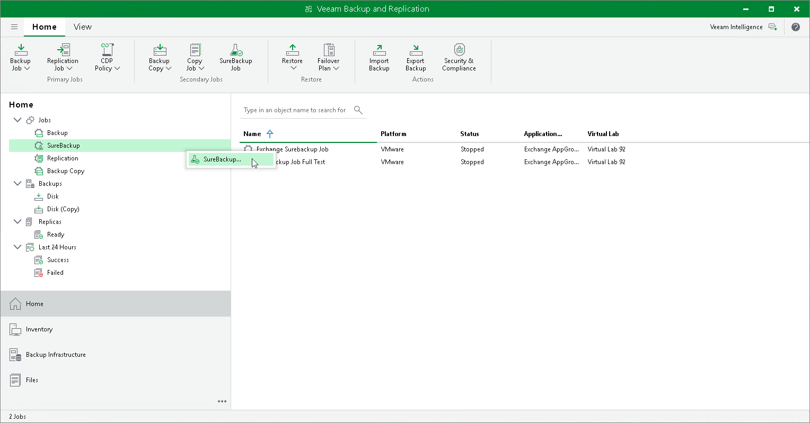

# Step 1. Launch New SureBackup Job Wizard

To launch the New SureBackup Job wizard, do either of the following:

* Open the Backup Infrastructure view, in the inventory pane select SureBackup. In the working area, click Add SureBackup Job.
* Open the Home view. On the Home tab, click SureBackup Job on the ribbon.
* Open the Home view. In the inventory pane, right-click SureBackup under Jobs and select SureBackup.

You can use this method if you already have at least one SureBackup job. If there are no SureBackup jobs, the SureBackup node will not be displayed in the inventory pane. In this case, you can right-click Jobs in the inventory pane and select SureBackup.

