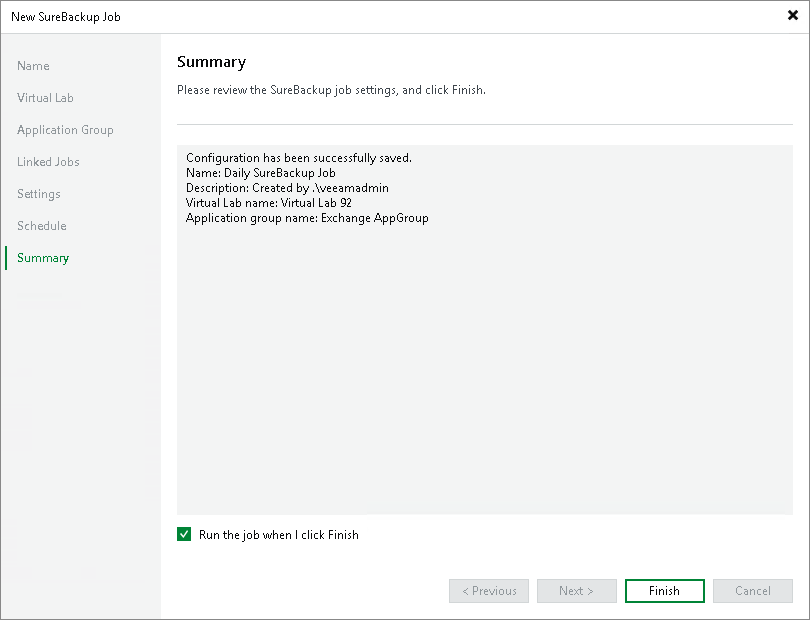

# Step 9. Review Job Summary and Finish Working with Wizard

At the Summary step of the wizard, complete the procedure of SureBackup job configuration.

1. Review details of the SureBackup job.
2. If you want to start the job right after you finish working with the wizard, select the Run the job when I click Finish check box.
3. Click Finish to save the SureBackup job settings and close the wizard.

