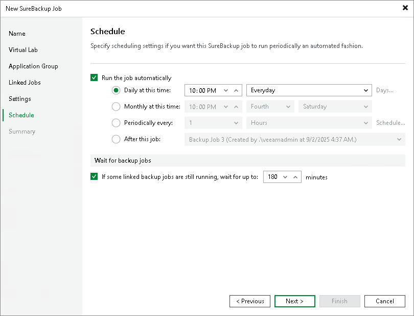

# Step 8. Specify Job Schedule

In this article

At the Schedule step of the wizard, select to manually run the SureBackup job or schedule the job at specific time, for example, after the backup or replication job completes. Keep in mind that SureBackup job will be stopped during synthetic operations (synthetic full backup, backup files merge and transformation) against the source backup chain, health check and replication session even if SureBackup job is scheduled to run.

1. To define a job schedule, select the Run the job automatically check box. If this check box is not selected, you will have to manually start the job to perform recovery verification.
2. Select the required schedule option:

+ Daily at this time. You can specify the time and select the days option from the drop-down list on which the SureBackup job will run: Everyday, On weekdays or On these days. If you select On these days option, click Days to specify them.
+ Monthly at this time. You can specify the time and select the day options from the drop-down lists on which the SureBackup job will run. Click Months to specify months on which the SureBackup job will run.
+ Periodically every. You can select the time options from the drop-down list or click Schedule to select the desired time area. Use the Permitted and the Denied options to mark the selected time segments. Use the Start time within an hour option to specify minutes. To run the job continuously, select Continuously from the drop-down list. A new job session will start as soon as the previous job session finishes.
+ After this job. If you choose this option, select the job from the drop-down list after which the SureBackup job will run. Typically, a SureBackup job should run after the linked backup or replication job completes. In this case, the SureBackup job will verify the VM backup or VM replica created by the source backup or replication job.

To create a chain of jobs, you must define the time schedule for the first job in the chain. For the rest of the jobs in the chain, at the Schedule step of the wizard, select the After this job option and choose the preceding job from the list.

|  |
| --- |
| Note |
| When you configure the job schedule, keep in mind possible date and time changes (for example, related to daylight saving time transition). |

1. In some cases, the linked backup or replication job may not complete until the SureBackup job starts. If Veeam Backup & Replication finds out that the linked job is still running, the SureBackup job will fail to start. To overcome this situation, select the If some linked backup jobs are still running, wait up to <N> minutes check box and specify the necessary time period in the field on the right. If the linked job is still running, Veeam Backup & Replication will wait for the defined period of time and check the linked job after this period elapses.

* If the linked job is finished within the specified period, the SureBackup job will start.
* If the linked job is still running, the SureBackup job will not start.

Page updated 9/3/2025

Page content applies to build 13.0.1.1071
