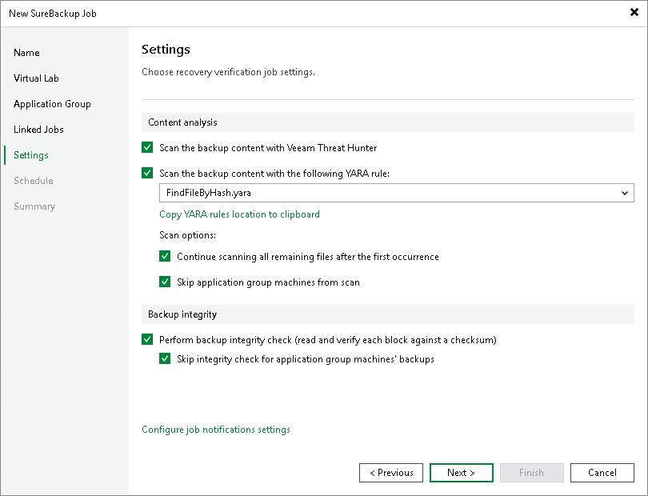
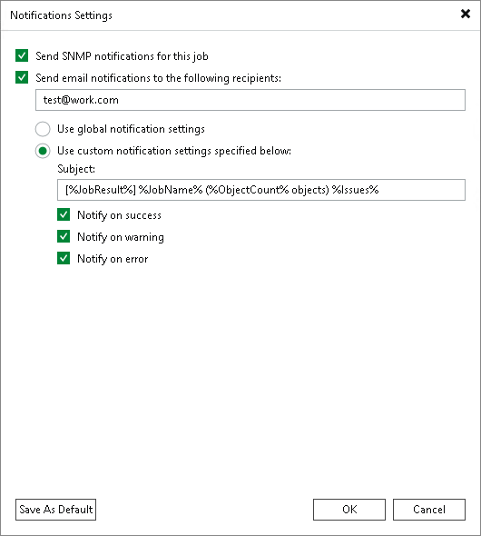

# Step 7. Specify Additional Job Settings

On the Settings step of the wizard, specify additional settings for the SureBackup job.

Specifying Additional Job Settings

1. If you want Veeam Backup & Replication to scan VM data with antivirus software, select the Scan backup content with Veeam Threat Hunter or Scan backup content with your existing software check box. Name of the check box depends on the settings specified in [Signature Detection](malware_detection_signature_detection.md). For more information, see [Secure Restore](av_scan_about.md).

+ If you want the antivirus software to continue scanning VM data after the first malware is found, select the Continue scanning remaining files after the first occurrence check box. For information on how to view results of the malware scan, see [Viewing Recovery Verification Job Statistics](viewing_surebackup_stats.md).
+ [For full recoverability testing mode] If you do not want to scan VMs from the application group, select the Skip application group machines from malware scan check box. In this case, the antivirus will only scan VMs from linked jobs.

Veeam Backup & Replication scans VM data with antivirus before running verification tests. Consider that the SureBackup job may take considerable time to complete if you are verifying backups of large sized VMs.

1. If you want Veeam Backup & Replication to scan VM data with YARA rule, select the Scan backup content with the following YARA rule check box and select the YARA rule from the drop-down list. For YARA rules to appear, they should be placed in the folder by the following path: %Program Files%\Veeam\Backup and Replication\Backup\YaraRules. Veeam Backup & Replication accepts only .yar and .yara extension. Veeam Backup & Replication can not scan VM replicas with YARA rule.
2. [For backups only] If you want to validate the backup file with a CRC check and make sure that the file is not corrupted, select the Perform backup integrity check check box. If you selected Full recoverability testing mode at the Name step of the wizard, you can optionally exclude VMs being a part of the application group from this test. To do this, select the Skip integrity check for application group machines' backup check box. For more information, see [Backup Recovery Verification Tests](surebackup_tests.md).

|  |
| --- |
| Note |
| [For full recoverability testing mode only] If you enable the Keep the application group running after the job completes option at the Application Group step of the wizard, the Skip integrity check for application group machines' backup option will be automatically enabled. |

To configure notifications settings, click Configure job notification settings and specify notification settings:

1. If you want to receive SNMP notifications, select the Send SNMP notifications for this job check box.

SNMP notifications will be sent only if you configure global SNMP settings in Veeam Backup & Replication and on recipient’s computer. For more information, see [Specifying SNMP Settings](snmp_settings.md).

1. If you want to receive notifications by email, select the Send email notifications to the following recipients check box. In the field under the check box, specify the recipient email address. You can enter several addresses separated by a semicolon.

Email notifications will be sent only if you configure global email notification settings in Veeam Backup & Replication. For more information, see [Specifying Email Notification Settings](email_notification_settings.md).

1. If you want to receive notifications only if the job finishes with specific states, select the required check boxes. For example, Notify on warning and Notify on error. If you want to receive all notifications, select all the check boxes.

