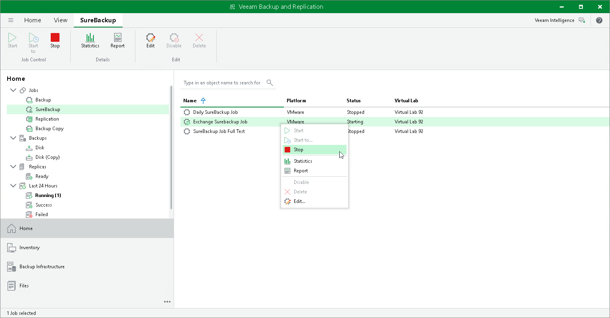

# Starting and Stopping SureBackup Job

In this article

You can instruct the SureBackup job to verify the latest restore point of a VM backup or select a specific restore point to which the VM from the backup must be started.

To start a VM from the latest restore point:

1. Open the Home view.
2. In the inventory pane, click SureBackup under Jobs.
3. In the working area, select the SureBackup job and click Start on the ribbon. You can also right-click the SureBackup job and select Start. Veeam Backup & Replication will start, verify and perform necessary tests for VMs from the latest restore point.

To start VMs from a specific point in time:

1. Open the Home view.
2. In the inventory pane, select SureBackup under Jobs.
3. In the working area, select the SureBackup job and click Start to on the ribbon. You can also right-click the SureBackup job and select Start to.
4. In the Restore Point window, select an approximate date of the restore point creation. Veeam Backup & Replication will pick the most recent restore point prior to this time and start, verify and perform necessary tests for VMs from this restore point.

To stop a running SureBackup job session:

1. Open the Home view.
2. In the inventory pane, select SureBackup under Jobs.
3. In the working area, select the SureBackup job and click Stop on the ribbon. You can also right-click the SureBackup job and select Stop.

Page updated 5/5/2025

Page content applies to build 13.0.1.1071
