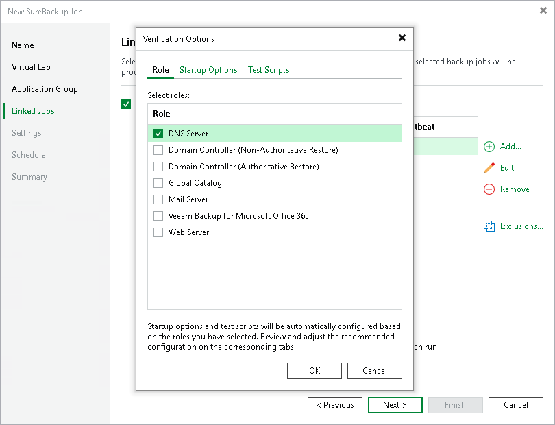
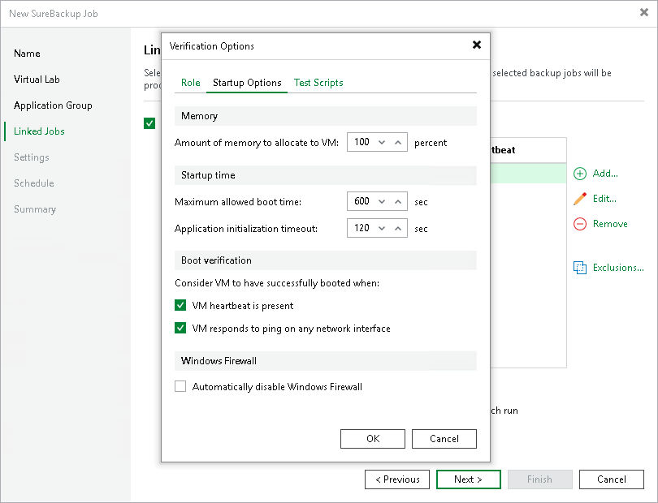
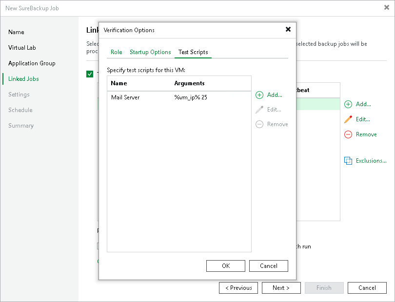
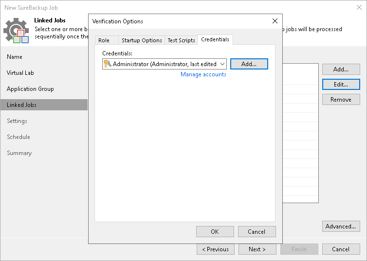

# Step 6. Specify Recovery Verification Options and Tests

Specifying recovery verification options and tests is available only for SureBackup job working in Full recoverability testing mode.

You must specify verification options for every machine from the jobs linked to the SureBackup job:

* [Select a role that a machine performs](surebackup_job_tests_vm.md#role).
* [Configure startup settings](surebackup_job_tests_vm.md#startup).
* [Select tests that must be performed for the machine](surebackup_job_tests_vm.md#test).
* [For Veeam Backup & Replication on Windows] [Specify credentials for running the verification script](#creds).

If all machines in the linked job perform the same role, you can specify startup options and test settings for the whole job in bulk. If machines have different roles, you can granularly specify startup options and test settings for every machine in the job.

* To specify startup options and select tests for the whole job, select a job in the list and click Edit on the right.
* To specify startup options and select tests for every machine in the job separately, select a job in the list and click Advanced on the right. Click Add and in the Add Objects window, select a machine. Select the added machine in the list, click Edit and specify settings.

If you use tags to categorize virtual infrastructure objects, check the limitations for VM tags. For more information, see [VM Tags](vm_tags.md).

|  |
| --- |
| Important |
| If you specify startup options and tests individually for every machine, Veeam Backup & Replication will apply these options and tests only. Options and tests specified at the level of the SureBackup job will be ignored for this machine. |

Role Settings

On the Role tab, select the role that the machine performs. Veeam Backup & Replication offers the following predefined roles for machines:

* DNS Server
* Domain Controller (Authoritative Restore)

In the Authoritative Restore mode, Veeam Backup & Replication starts a domain controller in the virtual lab and marks it as being authoritative to its replication partners. When other domain controllers (replication partners) are started in the virtual lab, they replicate data from the domain controller started in the Authoritative Restore mode.

* Domain Controller (Non-Authoritative Restore)

In the Non-Authoritative Restore mode, Veeam Backup & Replication restores a domain controller in the virtual lab and marks it as being non-authoritative to its replication partners. Non-authoritative domain controllers then replicate data from a domain controller started in the Authoritative Restore mode.

* Global Catalog
* Mail Server
* [For Veeam Backup & Replication on Windows] SQL Server
* Veeam Backup for Microsoft 365 (machine on which Veeam Backup for Microsoft 365 is installed)
* Web Server

Machine roles are described in XML files stored in the /var/lib/veeam/sbroles folder on Linux and in the %ProgramFiles%\Veeam\Backup and Replication\Backup\SbRoles folder on Windows. You can add your own roles. To do this, you need to create a new XML file and specify role and test scripts settings in it. For more information, see [Creating XML files with Machine Roles Description](creating_xml_files.md).

After you select the necessary role, Veeam Backup & Replication will automatically configure startup options and assign predefined test scripts for the chosen role. You can use these settings or specify custom settings on the Startup Options and Test Scripts tabs.

To verify machines that perform roles other than those specified in the list, you will have to manually configure startup options and specify test scripts that must be run for these machines.

VM Startup Settings

To configure VM startup settings:

1. In the Verification Options window, click the Startup Options tab.
2. In the Memory section, specify the amount of memory that you want to pre-allocate to the VM when this VM starts. The amount of pre-allocated memory is defined in percents. The percentage rate is calculated based on the system memory level available for the production VM. For example, if 1024 MB of RAM is allocated to the VM in the production environment and you specify 80% as a memory rate, 820 MB of RAM will be allocated to the verified VM on startup.

Veeam Backup & Replication does not allow you to change the number of VM vCPUs manually, it does this automatically. If the VM requires more vCPUs than the host can provide, Veeam Backup & Replication scales down the vCPUs of the VM.

1. In the Startup time section, specify the allowed boot time for the VM and the timeout to initialize applications on the VM.

Be careful when specifying the Maximum allowed boot time value. Typically, a VM started by a SureBackup job requires more time to boot than a VM started in the production environment. If a VM fails to be initialized within the specified interval of time, the recovery verification process fails with the timeout error. If such error occurs, you need to increase the Maximum allowed boot time value and run the SureBackup job again.

1. In the Boot verification section, specify when the VM is considered to be successfully booted:

* VM heartbeat is present. If you enable this option, Veeam Backup & Replication will perform a heartbeat test for the verified VM.
* VM responds to ping on any network interface. If you enable this option, Veeam Backup & Replication will perform a ping test for the verified VM.

* Automatically disable Windows Firewall. If you select this option, Veeam Backup & Replication will disable Windows Firewall for the verified VM.

If you enable both options, Veeam Backup & Replication will require that both tests are completed successfully: heartbeat test and ping test.

|  |
| --- |
| Important |
| Do not pass sensitive information using script arguments in a user interface. |

|  |
| --- |
| Note |
| Veeam Backup & Replication performs a heartbeat test only if a machine has VMware Tools installed. If VMware Tools are not installed, the machine will be started but the test will not be performed. |

Test Script Settings

When you select a machine role, Veeam Backup & Replication automatically assigns a predefined script that must be run to verify applications inside the machine. If you want to verify a machine that has some other role not listed on the Role tab, do the following:

1. In the Verification Options window, click the Test Scripts tab.
2. Click Add.
3. In the Test Scripts window, select Use the following test script.
4. In the Name field, specify a name for the script.
5. In the Path field, define the path to an executable script file that must be run to verify the machine. You can do one of the following:

* If you have your own custom script, define a path to it in the Path field.
* [For Veeam Backup & Replication on Linux] If you do not have a custom script, you can use Veeam standard utility that probes application communication ports. The utility is located in the installation folder of Veeam Backup & Replication. To use it, specify Veeam.Backup.ConnectionTester.exe in the Path field.
* [For Veeam Backup & Replication on Windows] If you do not have a custom script, you can use a standard utility by Veeam, Veeam.Backup.ConnectionTester.exe, that probes application communication ports. The utility is located in the installation folder of Veeam Backup & Replication: %ProgramFiles%\Veeam\Backup and Replication\Backup\Veeam.Backup.ConnectionTester.exe. Specify this path in the Path field.

|  |
| --- |
| Note |
| Use single quotation marks if you want to pass a [literal string](https://learn.microsoft.com/en-us/powershell/module/microsoft.powershell.core/about/about_quoting_rules?view=powershell-7.5) as an argument for your custom script in the script path. |

1. In the Arguments field, specify the IP address of the verified machine and the port that you want to probe (if the selected test probes the port). You can use the %vm\_ip% variable to define the machine IP address or the %vm\_fqdn% variable to define the machine FQDN.

For Microsoft SQL Server, you can also specify a path to the log file in the %log\_path% argument. For more information, see [Backup Recovery Verification Tests](surebackup_tests.md).

|  |
| --- |
| Note |
| Script arguments are processed by the OS interpreter and should be formatted in a way that is expected by the script and understood by the interpreter. |

1. Click OK to add the configured test.

To edit test settings, select the test in the list and click Edit. To delete a test, select it in the list and click Remove.

If a VM performs several roles and runs a number of applications, you can add several verification scripts to verify work of these applications. It is recommended that you specify the maximum startup timeout value and allocate the greatest amount of memory for such VMs.

|  |
| --- |
| Note |
| Exit codes for SureBackup custom PowerShell scripts will return 0 or 1 depending on whether the script executed without exceptions. To utilize different error codes, set the $? variable value within your script. For more information, see [Microsoft Docs](https://learn.microsoft.com/en-us/powershell/module/microsoft.powershell.core/about/about_automatic_variables?view=powershell-7.4#lastexitcode). |

Credentials Settings

In the Credentials tab, specify credentials to authenticate in the machine where you need to run the script.

1. Click the Credentials tab.
2. From the Credentials list, select credentials for the account under which you want to run the script.

If you have not set up credentials beforehand, click the Manage accounts link or click Add on the right to add the credentials. For more information, see [Credentials Manager](credentials_manager.md).

