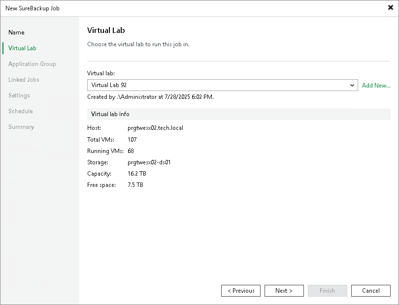

# Step 3. Select Virtual Lab

In this article

Selecting virtual lab is available only for SureBackup job working in Full recoverability testing mode.

At the Virtual Lab step of the wizard, select a virtual lab that you want to use for recovery verification.

If you do not have a virtual lab, click Add New and complete the [New Virtual Lab](create_vlab.md) wizard to create a new virtual lab.

1. From the Virtual Lab list, select a virtual lab. The list contains all virtual labs that are created or connected to the backup server.
2. In the Virtual lab info section, review information about the selected virtual lab.

Page updated 9/3/2025

Page content applies to build 13.0.1.1071
