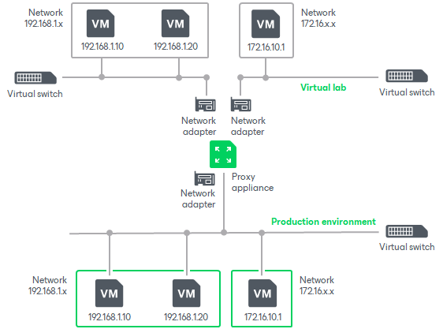

# Proxy Appliance

In this article

To enable communication between the production environment and isolated networks in the virtual lab, Veeam Backup & Replication uses a proxy appliance. The proxy appliance is an auxiliary Linux-based VM that is deployed on the Hyper-V host where the virtual lab is created. The proxy appliance VM is assigned an IP address from the production network and placed to the dedicated virtual lab folder  on the Hyper-V host.

The proxy appliance is connected to the production network and to the isolated network, so that it has visibility of the production environment and virtual lab. In essence, the proxy appliance acts as a gateway between the two networks — it routes requests from the production environment to VMs in the virtual lab.

To connect to isolated networks, the proxy appliance uses network adapters. Veeam Backup & Replication adds to the proxy appliance one network adapter per every isolated network. For example, if there are two networks in the virtual lab, Veeam Backup & Replication will add two network adapters to the proxy appliance. The network adapter gets an IP address from the isolated network. Typically, this IP address is the same as the IP address of the default gateway in the production network.

The proxy appliance is an optional component for recovery verification. Technically, you can create a virtual lab without the proxy appliance. However, in this case, you will not be able to perform automatic recovery verification of VMs. VMs will be started from backups in the virtual lab; you will have to access them using the VM console and perform necessary tests manually.

Page updated 5/5/2025

Page content applies to build 13.0.1.1071
