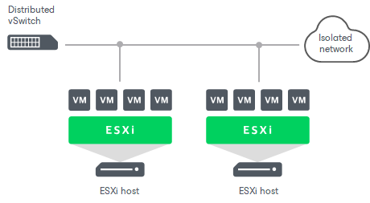

# Advanced Multi-Host Virtual Labs

The advanced multi-host virtual lab configuration can be used if your disaster recovery (DR) site is configured in the following way:

* VM replicas that you want to verify are located on different ESXi hosts.
* VM replicas that you want to verify are connected to one or several networks.

The advanced multi-host virtual lab leverages the VMware Distributed vSwitch (DVS) technology. For more information, see [VMware Docs](https://www.vmware.com/products/vsphere/distributed-switch.html).

When you configure an advanced multi-host virtual lab, you must select an ESXi host on which the proxy server will be created and DVS on which Veeam Backup & Replication will create isolated networks.

Veeam Backup & Replication does not offer an option to automatically configure the DVS. The DVS must be preconfigured in your virtual environment correctly and allow traffic to traverse between all ESXi hosts assigned to the DVS. Failure to assign valid uplinks to the DVS will cause the job to fail.

|  |
| --- |
| Important |
| DVS is limited to one datacenter. For this reason, all verified VM replicas and VM replicas from the application group must belong to the same datacenter. If VM replicas belong to different datacenters, you will be able to start them in the virtual lab but Veeam Backup & Replication will not be able to automatically verify them. |

Related Topics

* [Isolated Networks on DVS](surereplica_advanced_mutihost_networks.md)
* [Port Groups and VLAN IDs](surereplica_multihost_portgroup_vlan_id.md)

