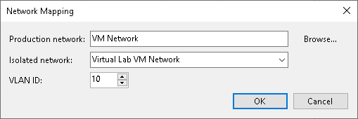

# Isolated Networks on DVS

In this article

For every isolated network in the virtual lab, Veeam Backup & Replication adds a new DVS port group to the DVS. The added port group is named after the isolated network.

The port groups created on the DVS must be isolated from the production environment. To isolate port groups, you can use one of the following methods:

1. Connect DVS uplinks to the isolated network. You can link the DVS that you plan to use for recovery verification to an external isolated network using uplink adapters. This operation must be performed manually by the backup administrator.

1. Use VLAN tagging. This method can be used only if your switch supports VLAN ID tagging. When you specify settings for isolated networks in the New Virtual Lab wizard, you can define different VLAN IDs for different isolated networks. Setting VLAN IDs restricts communication of VM replicas in the isolated network from the production environment.

|  |
| --- |
| Important |
| If your network does not support VLAN ID tagging or the virtual lab is configured incorrectly, VM replicas will be started in the virtual lab but Veeam Backup & Replication will not be able to automatically verify them. |

Page updated 8/16/2024

Page content applies to build 13.0.1.1071
