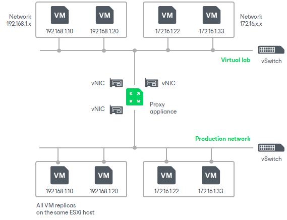

# Advanced Single-Host Virtual Labs

In this article

The advanced single-host virtual lab configuration can be used if your virtual environment is configured in the following way:

* All VM replicas that you want to verify are located on the same ESXi host.
* VM replicas you want to verify are connected to different networks.

|  |
| --- |
| Important |
| For this configuration type, the virtual lab must be created on the same ESXi host where VMs replicas are located. If you create the virtual lab on some other ESXi host, the SureBackup job will fail. |

In the advanced single-host virtual lab, Veeam Backup & Replication creates several virtual networks. The number of virtual networks corresponds to the number of production networks to which verified VM replicas are connected. Networks in the virtual lab are mapped to production networks.

Veeam Backup & Replication automatically adds a number of new VMware objects on the ESXi host where the virtual lab is created:

* A resource pool
* A VM folder
* A standard vSwitch

The vSwitch is only used by the VMs started in the virtual lab. There is no routing outside the virtual lab to other networks.

When you create an advanced single-host virtual lab, Veeam Backup & Replication configures basic settings for networks that are created in the virtual lab. You need to review these settings and manually adjust them.

Page updated 8/16/2024

Page content applies to build 13.0.1.1071
