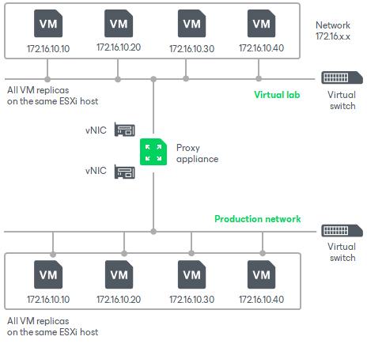

# Basic Single-Host Virtual Labs

The basic single-host virtual lab configuration can be used if your disaster recovery (DR) site is configured in the following way:

* All VM replicas that you want to verify are registered on the same ESXi host.
* All VM replicas that you want to verify are connected to the same network.

|  |
| --- |
| Important |
| For this configuration type, the virtual lab must be created on the same ESXi host where VMs replicas are located. If you create the virtual lab on some other ESXi host, the SureBackup job will fail. |

For the basic single-host virtual lab, Veeam Backup & Replication creates one virtual network that is mapped to the production network. Additionally, Veeam Backup & Replication automatically adds a number of new VMware objects on the ESXi host where the virtual lab is created:

* A resource pool
* A VM folder
* A standard vSwitch

The vSwitch is only used by the VMs started in the virtual lab. There is no routing outside the virtual lab to other networks.

Veeam Backup & Replication automatically configures all settings for the basic single-host virtual lab. The proxy appliance is also created and configured automatically and placed to the virtual lab folder and resource pool on the ESXi host.

